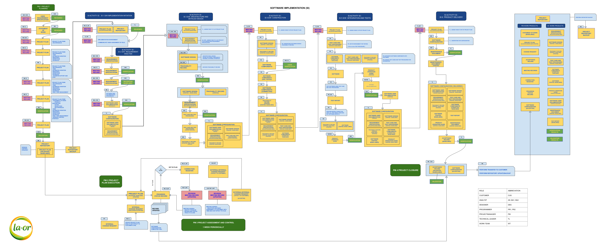

  

# RABBIT WORKFLOW (RBWF) - ISO/IEC 29110 WORK PRODUCTS BASELINE INDEX

## 1.0 Project Initiation

| WP | ISO/IEC 29110 Work Products | ชื่อเอกสาร (RBWF) | URL |
|---|---|---|---|
| WP.02 | Agreement | RBWF_SOW_v1_0 | [RBWF_SOW_v1_0](https://symphosoftworkflow.github.io/ISO-IEC-29110-RBWF/BASELINE/RBWF_SOW_v1_0) |
| WP.02 | Verification Record (SOW) | RBWF_VER_SOW_20260115 | [RBWF_VER_SOW_20260115](https://symphosoftworkflow.github.io/ISO-IEC-29110-RBWF/BASELINE/RBWF_VER/RBWF_VER_SOW_20260115) |

## 2.0 Project Planning

| WP | ISO/IEC 29110 Work Products | ชื่อเอกสาร (RBWF) | URL |
|---|---|---|---|
| | Work Process Flow | ISO_IEC_29110_PROCESS_LA-OR_V8 | [ISO_IEC_29110_PROCESS_LA-OR_V8](../PROCESS/ISO_IEC_29110_PROCESS_LA-OR_V8.png) |
| | Version Control Strategy | RBWF_SCM_v1_0 | [RBWF_SCM_v1_0](https://symphosoftworkflow.github.io/ISO-IEC-29110-RBWF/BASELINE/RBWF_SCM_v1_0) |
| WP.10 | Project Plan (Val) | RBWF_PMP_v1_0 | [RBWF_PMP_v1_0](https://symphosoftworkflow.github.io/ISO-IEC-29110-RBWF/BASELINE/RBWF_PMP_v1_0) |
| WP.10 | Project Plan Cost (ส่วนประกอบของแผนโครงการ) | RBWF_PMPC_v1_0 | [RBWF_PMPC_v1_0](https://symphosoftworkflow.github.io/ISO-IEC-29110-RBWF/BASELINE/RBWF_PMPC_v1_0) |
| WP.22 | Validation Record (Ver) | RBWF_VER_PMP_20260120 | [RBWF_VER_PMP_20260120](https://symphosoftworkflow.github.io/ISO-IEC-29110-RBWF/BASELINE/RBWF_VER/RBWF_VER_PMP_20260120) |
| WP.07 | Meeting Record / เอกสารที่แสดงถึง PP ผ่านการตรวจสอบจากลูกค้า (Val) | RBWF_MOM_20260130 | [RBWF_MOM_20260130](https://symphosoftworkflow.github.io/ISO-IEC-29110-RBWF/BASELINE/RBWF_MOM/RBWF_MOM_20260130) |
| WP.11 | Project Repository | ISO-IEC-29110-RBWF | [ISO-IEC-29110-RBWF](https://github.com/symphosoftworkflow/ISO-IEC-29110-RBWF) |

## 3.0 Software Implementation Initiation

| WP | ISO/IEC 29110 Work Products | ชื่อเอกสาร (RBWF) | URL |
|---|---|---|---|
| WP.05 | Implementation Environment | RBWF_IE_v1_0 | [RBWF_IE_v1_0](https://symphosoftworkflow.github.io/ISO-IEC-29110-RBWF/BASELINE/RBWF_IE_v1_0) |
| WP.05 | Verification Record (IE) | RBWF_VER_IE_20260125 | [RBWF_VER_IE_20260125](https://symphosoftworkflow.github.io/ISO-IEC-29110-RBWF/BASELINE/RBWF_VER/RBWF_VER_IE_20260125) |

## 4.0 Software Requirements Analysis

| WP | ISO/IEC 29110 Work Products | ชื่อเอกสาร (RBWF) | URL |
|---|---|---|---|
| WP.13 | Requirements Specification (Ver, Val) | RBWF_SRS_v1_0 | [RBWF_SRS_v1_0](https://symphosoftworkflow.github.io/ISO-IEC-29110-RBWF/BASELINE/RBWF_SRS_v1_0) |
| WP.23 | Verification Record (SRS) | RBWF_VER_SRS_20260215 | [RBWF_VER_SRS_20260215](https://symphosoftworkflow.github.io/ISO-IEC-29110-RBWF/BASELINE/RBWF_VER/RBWF_VER_SRS_20260215) |
| WP.22 | Validation Record (SRS) | RBWF_VLD_20260205 | [RBWF_VLD_20260205](https://symphosoftworkflow.github.io/ISO-IEC-29110-RBWF/BASELINE/RBWF_VLD/RBWF_VLD_20260205) |

## 5.0 Software Design

| WP | ISO/IEC 29110 Work Products | ชื่อเอกสาร (RBWF) | URL |
|---|---|---|---|
| WP.16 | Software Design (Ver) | RBWF_SDD_v1_0 | [RBWF_SDD_v1_0](https://symphosoftworkflow.github.io/ISO-IEC-29110-RBWF/BASELINE/RBWF_SDD_v1_0) |
| WP.23 | Verification Record (SDD) | RBWF_VER_SDD_20260310 | [RBWF_VER_SDD_20260310](https://symphosoftworkflow.github.io/ISO-IEC-29110-RBWF/BASELINE/RBWF_VER/RBWF_VER_SDD_20260310) |

## 6.0 Software Construction

| WP | ISO/IEC 29110 Work Products | ชื่อเอกสาร (RBWF) | URL |
|---|---|---|---|
| WP.15 | Software Components | RBWF_SWC_v1_0 | [RBWF_SWC_v1_0](https://symphosoftworkflow.github.io/ISO-IEC-29110-RBWF/BASELINE/RBWF_SWC_v1_0) |
| WP.14 | Software | workflowv2.rabbittile.com | [workflowv2.rabbittile.com](https://github.com/symphosoftworkflow/workflowv2.rabbittile.com) |

## 7.0 Project Execution, Assessment and Control

| WP | ISO/IEC 29110 Work Products | ชื่อเอกสาร (RBWF) | URL |
|---|---|---|---|
| WP.04 | Correction Register | RBWF_CRR | [RBWF_CRR](https://symphosoftworkflow.github.io/ISO-IEC-29110-RBWF/BASELINE/RBWF_CRR) |
| WP.07 | Meeting Record (Internal) | RBWF_MOM_20260128 | [RBWF_MOM_20260128](https://symphosoftworkflow.github.io/ISO-IEC-29110-RBWF/BASELINE/RBWF_MOM/RBWF_MOM_20260128) |
| WP.07 | Meeting Record (External) | RBWF_MOM_20260130 | [RBWF_MOM_20260130](https://symphosoftworkflow.github.io/ISO-IEC-29110-RBWF/BASELINE/RBWF_MOM/RBWF_MOM_20260130) |
| WP.07 | Meeting Record (Internal) | RBWF_MOM_20260131 | [RBWF_MOM_20260131](https://symphosoftworkflow.github.io/ISO-IEC-29110-RBWF/BASELINE/RBWF_MOM/RBWF_MOM_20260131) |
| WP.07 | Meeting Record (Internal) | RBWF_MOM_20260225 | [RBWF_MOM_20260225](https://symphosoftworkflow.github.io/ISO-IEC-29110-RBWF/BASELINE/RBWF_MOM/RBWF_MOM_20260225) |
| WP.07 | Meeting Record (External) | RBWF_MOM_20260227 | [RBWF_MOM_20260227](https://symphosoftworkflow.github.io/ISO-IEC-29110-RBWF/BASELINE/RBWF_MOM/RBWF_MOM_20260227) |
| WP.07 | Meeting Record (Internal) | RBWF_MOM_20260228 | [RBWF_MOM_20260228](https://symphosoftworkflow.github.io/ISO-IEC-29110-RBWF/BASELINE/RBWF_MOM/RBWF_MOM_20260228) |
| WP.07 | Meeting Record (Internal) | RBWF_MOM_20260325 | [RBWF_MOM_20260325](https://symphosoftworkflow.github.io/ISO-IEC-29110-RBWF/BASELINE/RBWF_MOM/RBWF_MOM_20260325) |
| WP.07 | Meeting Record (External) | RBWF_MOM_20260327 | [RBWF_MOM_20260327](https://symphosoftworkflow.github.io/ISO-IEC-29110-RBWF/BASELINE/RBWF_MOM/RBWF_MOM_20260327) |
| WP.07 | Meeting Record (Internal) | RBWF_MOM_20260328 | [RBWF_MOM_20260328](https://symphosoftworkflow.github.io/ISO-IEC-29110-RBWF/BASELINE/RBWF_MOM/RBWF_MOM_20260328) |
| WP.07 | Meeting Record (Internal) | RBWF_MOM_20260422 | [RBWF_MOM_20260422](https://symphosoftworkflow.github.io/ISO-IEC-29110-RBWF/BASELINE/RBWF_MOM/RBWF_MOM_20260422) |
| WP.07 | Meeting Record (External) | RBWF_MOM_20260424 | [RBWF_MOM_20260424](https://symphosoftworkflow.github.io/ISO-IEC-29110-RBWF/BASELINE/RBWF_MOM/RBWF_MOM_20260424) |
| WP.07 | Meeting Record (Internal) | RBWF_MOM_20260425 | [RBWF_MOM_20260425](https://symphosoftworkflow.github.io/ISO-IEC-29110-RBWF/BASELINE/RBWF_MOM/RBWF_MOM_20260425) |
| WP.07 | Meeting Record (Internal) | RBWF_MOM_20260527 | [RBWF_MOM_20260527](https://symphosoftworkflow.github.io/ISO-IEC-29110-RBWF/BASELINE/RBWF_MOM/RBWF_MOM_20260527) |
| WP.07 | Meeting Record (External) | RBWF_MOM_20260529 | [RBWF_MOM_20260529](https://symphosoftworkflow.github.io/ISO-IEC-29110-RBWF/BASELINE/RBWF_MOM/RBWF_MOM_20260529) |
| WP.07 | Meeting Record (Internal) | RBWF_MOM_20260530 | [RBWF_MOM_20260530](https://symphosoftworkflow.github.io/ISO-IEC-29110-RBWF/BASELINE/RBWF_MOM/RBWF_MOM_20260530) |
| WP.09 | Progress Status Record (Internal) | RBWF_PSR_202601 | [RBWF_PSR_202601](https://symphosoftworkflow.github.io/ISO-IEC-29110-RBWF/BASELINE/RBWF_PSR/RBWF_PSR_202601) |
| WP.09 | Progress Status Record (Internal) | RBWF_PSR_202602 | [RBWF_PSR_202602](https://symphosoftworkflow.github.io/ISO-IEC-29110-RBWF/BASELINE/RBWF_PSR/RBWF_PSR_202602) |
| WP.09 | Progress Status Record (Internal) | RBWF_PSR_202603 | [RBWF_PSR_202603](https://symphosoftworkflow.github.io/ISO-IEC-29110-RBWF/BASELINE/RBWF_PSR/RBWF_PSR_202603) |
| WP.09 | Progress Status Record (Internal) | RBWF_PSR_202604 | [RBWF_PSR_202604](https://symphosoftworkflow.github.io/ISO-IEC-29110-RBWF/BASELINE/RBWF_PSR/RBWF_PSR_202604) |
| WP.09 | Progress Status Record (Internal) | RBWF_PSR_202605 | [RBWF_PSR_202605](https://symphosoftworkflow.github.io/ISO-IEC-29110-RBWF/BASELINE/RBWF_PSR/RBWF_PSR_202605) |
| WP.09 | Progress Status Record (External) | ยังไม่มีไฟล์ | |
| WP.12 | Project Repository Backup | ยังไม่มีไฟล์แยก (อ้างแผน Backup ใน PMP) | [RBWF_PMP_v1_0](https://symphosoftworkflow.github.io/ISO-IEC-29110-RBWF/BASELINE/RBWF_PMP_v1_0) |

## 7.0 Traceability Control

| WP | ISO/IEC 29110 Work Products | ชื่อเอกสาร (RBWF) | URL |
|---|---|---|---|
| WP.21 | Traceability Record (RTM + Unit Test Result + Integration Test Result) | RBWF_RTM_v1_0 | [RBWF_RTM_v1_0](https://symphosoftworkflow.github.io/ISO-IEC-29110-RBWF/BASELINE/RBWF_RTM_v1_0) |

## 8.0 Software Testing

| WP | ISO/IEC 29110 Work Products | ชื่อเอกสาร (RBWF) | URL |
|---|---|---|---|
| WP.19 | Test Cases and Test Procedures (Ver) | RBWF_TP_v1_0 | [RBWF_TP_v1_0](https://symphosoftworkflow.github.io/ISO-IEC-29110-RBWF/BASELINE/RBWF_TP_v1_0) |
| WP.23 | Verification Record (Integration test cases) | RBWF_VER_TP_20260410 | [RBWF_VER_TP_20260410](https://symphosoftworkflow.github.io/ISO-IEC-29110-RBWF/BASELINE/RBWF_VER/RBWF_VER_TP_20260410) |
| WP.20 | Test Report | RBWF_TR_v1_0 | [RBWF_TR_v1_0](https://symphosoftworkflow.github.io/ISO-IEC-29110-RBWF/BASELINE/RBWF_TR_v1_0) |
| WP.20 | Verification Record (TR) | RBWF_VER_TR_20260515 | [RBWF_VER_TR_20260515](https://symphosoftworkflow.github.io/ISO-IEC-29110-RBWF/BASELINE/RBWF_VER/RBWF_VER_TR_20260515) |
| | Validation Record (UAT - Customer) | RBWF_UAT_v1_0 | [RBWF_UAT_v1_0](https://symphosoftworkflow.github.io/ISO-IEC-29110-RBWF/BASELINE/RBWF_UAT_v1_0) |

## 9.0 Change Management

| WP | ISO/IEC 29110 Work Products | ชื่อเอกสาร (RBWF) | URL |
|---|---|---|---|
| WP.03 | Change Request | RBWF_CR | [RBWF_CR](https://symphosoftworkflow.github.io/ISO-IEC-29110-RBWF/BASELINE/RBWF_CR) |
| WP.03 | Change Request | RBWF_CR_20260315 | [RBWF_CR_20260315](https://symphosoftworkflow.github.io/ISO-IEC-29110-RBWF/BASELINE/RBWF_CR/RBWF_CR_20260315) |
| WP.03 | Change Request | RBWF_CR_20260420 | [RBWF_CR_20260420](https://symphosoftworkflow.github.io/ISO-IEC-29110-RBWF/BASELINE/RBWF_CR/RBWF_CR_20260420) |

## 11.0 Software Product Assembly

| WP | ISO/IEC 29110 Work Products | ชื่อเอกสาร (RBWF) | URL |
|---|---|---|---|
| WP.18 | Software User Documentation (Ver) — End User | RBWF_SUD_v1_0 | [RBWF_SUD_v1_0](https://symphosoftworkflow.github.io/ISO-IEC-29110-RBWF/BASELINE/RBWF_SUD_v1_0) |
| WP.23 | Verification Record (SUD) | RBWF_VER_SUD_20260520 | [RBWF_VER_SUD_20260520](https://symphosoftworkflow.github.io/ISO-IEC-29110-RBWF/BASELINE/RBWF_VER/RBWF_VER_SUD_20260520) |
| WP.08 | Product Operation Guideline (Ver) — User Admin | RBWF_POG_v1_0 | [RBWF_POG_v1_0](https://symphosoftworkflow.github.io/ISO-IEC-29110-RBWF/BASELINE/RBWF_POG_v1_0) |
| WP.23 | Verification Record (POG) | ยังไม่มีไฟล์ | |
| WP.06 | Maintenance Documentation (Ver) — Technical | RBWF_MA_v1_0 | [RBWF_MA_v1_0](https://symphosoftworkflow.github.io/ISO-IEC-29110-RBWF/BASELINE/RBWF_MA_v1_0) |
| WP.23 | Verification Record (MA) | ยังไม่มีไฟล์ | |
| WP.17 | Software Product (Delivered) | workflowv2.rabbittile.com | [workflowv2.rabbittile.com](https://github.com/symphosoftworkflow/workflowv2.rabbittile.com) |

## 12.0 Project Closure

| WP | ISO/IEC 29110 Work Products | ชื่อเอกสาร (RBWF) | URL |
|---|---|---|---|
| WP.01 | Acceptance Record | RBWF_VLD_20260525 | [RBWF_VLD_20260525](https://symphosoftworkflow.github.io/ISO-IEC-29110-RBWF/BASELINE/RBWF_VLD/RBWF_VLD_20260525) |
