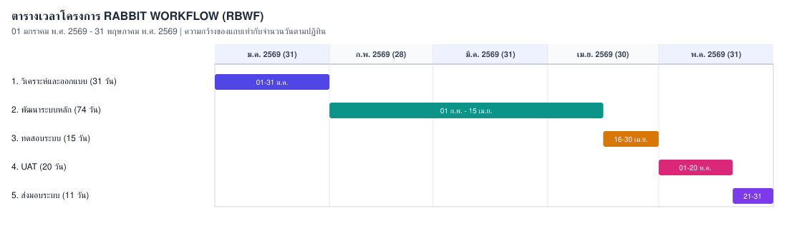

# เอกสาร แผนการดำเนินโครงการ (PROJECT PLAN DOCUMENT)  
  
**ชื่อระบบงาน[TH]**: ระบบบริหารงานธุรกิจจัดจำหน่ายวัสดุก่อสร้างและกระเบื้องครบวงจร  
**ชื่อระบบงาน[EN]**: Rabbit Workflow System (RBWF)  
  
**เวอร์ชัน**: 1.0  
**จัดทำโดย**: นางสาวปวริศา จันทรสถาพร (PM)  
**วันที่อนุมัติเอกสาร**: 20 มกราคม พ.ศ. 2569  

---

## ประวัติการจัดทำเอกสาร

| ลำดับ | เวอร์ชัน | รายละเอียดการดำเนินการ | ผู้ดำเนินการ | วันที่ดำเนินการ |
|---|---|---|---|---|
| 1 | 0.1 | จัดทำเอกสาร แผนการดำเนินโครงการ | นางสาวปวริศา จันทรสถาพร (PM) | 10 มกราคม พ.ศ. 2569 |
| 2 | 1.0 | อนุมัติเอกสาร แผนการดำเนินโครงการ | นายวีระ เนียมโภคะ (TL) | 20 มกราคม พ.ศ. 2569 |

---

## 1. วัตถุประสงค์ในการจัดทำแผน

- กำหนดแนวทางในการบริหารจัดการ การดำเนินงาน และการติดตามความก้าวหน้าโครงการ RABBIT WORKFLOW (RBWF)
- รวบรวมและสรุปรายละเอียดข้อกำหนดความต้องการซอฟต์แวร์ (Detail Requirements) ให้สอดคล้องกับขอบเขตในเอกสาร Statement of Work (SOW)
- จัดทำตารางการทำงาน (Project Schedule) กำหนดทรัพยากรบุคคล (Resource Allocation) และการบริหารงบประมาณ
- กำหนดโครงสร้างคลังโครงการ (Project Repository) แผนการสำรองข้อมูล (Backup & Recovery) และระบบบริหารคุณภาพ

---

## 2. สรุปรายละเอียดของความต้องการ (Detail Requirements)

ความต้องการในแผนนี้สรุปจากขอบเขตโครงการในเอกสาร SOW ข้อ 3.1–3.6 รหัสข้อกำหนดใช้ชุดเดียวกับเอกสาร SRS เพื่อให้ติดตามได้ใน RTM, TP และ TR  
หมายเหตุ: ไม่มี **REQ-STK-03** เพราะเป็นฟังก์ชัน Edging ที่ตัดออกจากขอบเขตแล้ว

### 2.1 Functional Requirements

#### 2.1.1 ระบบจัดการคลังสินค้าและสต็อกกระเบื้อง (SOW 3.1)
- **REQ-STK-01** บันทึกและจัดการรายการสินค้ากระเบื้อง ขนาด เกรด สี ราคา และตำแหน่งจัดเก็บในคลัง
- **REQ-STK-02** บันทึกรับเข้า-จ่ายออกสต็อกและปรับปรุงยอด (Stock Adjust)
- **REQ-STK-04** แจ้งเตือนสินค้าขั้นต่ำ (Stock Notification) ผ่านระบบและอีเมล

#### 2.1.2 ระบบการขายและใบเสนอราคา (SOW 3.2)
- **REQ-QTO-01** บันทึกและติดตามคำขอใบเสนอราคา (RFQ) จากลูกค้า
- **REQ-QTO-02** สร้างใบเสนอราคา คำนวณส่วนลด กำไรขั้นต้น และออกเอกสาร PDF
- **REQ-QTO-03** เวิร์กโฟลว์การอนุมัติใบเสนอราคาตามมูลค่าอนุมัติ
- **REQ-QTO-04** คำนวณค่าคอมมิชชันพนักงานขายและบันทึกประวัติการจ่าย

#### 2.1.3 ระบบจัดซื้อและออกคำสั่งซื้อ (SOW 3.3)
- **REQ-PO-01** สร้างและอนุมัติใบสั่งซื้อ (PO) ส่งไปยังผู้จัดจำหน่าย พร้อมออก PO PDF
- **REQ-PO-02** บันทึกรับสินค้าเข้าคลัง (PO Receipts) พร้อมอัปโหลดรูปภาพและใบรับสินค้า
- **REQ-PO-03** จัดการใบกำกับภาษี ใบเสร็จรับเงิน และบันทึกการชำระเงินค่างวด PO
- **REQ-PO-04** จัดการข้อมูลซัพพลายเออร์และประวัติการสั่งซื้อ

#### 2.1.4 ระบบจัดการงานช่าง การจัดส่ง และคิวงาน (SOW 3.4)
- **REQ-WRK-01** มอบหมายงานช่าง (Worker Jobs) และติดตามสถานะการตัด/เตรียมกระเบื้อง
- **REQ-WRK-02** ช่างอัปโหลดรูปภาพผลงานหลังทำเสร็จ
- **REQ-WRK-03** แสดงผลหน้าจอคิวเตรียมสินค้าแบบเรียลไทม์ผ่าน WebSocket
- **REQ-WRK-04** ออกใบส่งของ (Delivery Note PDF) และแจ้งเตือนสถานะการจัดส่ง

#### 2.1.5 ระบบการเงิน บัญชีเงินสด และรายงาน (SOW 3.5)
- **REQ-FIN-01** บันทึกสมุดบัญชีเงินสดรับ-จ่าย (Cash Ledger) และสรุปยอดคงเหลือ
- **REQ-FIN-02** บันทึกค่าใช้จ่ายองค์กร (Expenses) และคำขอเบิกจ่ายพนักงาน (Reimbursements)
- **REQ-FIN-03** คำนวณเงินเดือนพนักงาน (Salary) และออกใบเสร็จรับเงิน (Receipt PDF)
- **REQ-FIN-04** รายงานสรุปผลการดำเนินงานและรายงานการเงินประจำเดือน

#### 2.1.6 ระบบบริหารจัดการผู้ใช้งานและสิทธิ์ (SOW 3.6)
- **REQ-SEC-01** บริหารผู้ใช้งาน (Users), เอเจนต์ (Agents), พนักงาน (Workers) และผู้จัดจำหน่าย (Suppliers) กำหนดบทบาทและสิทธิ์ RBAC รวมถึงการเปลี่ยนรหัสผ่าน

### 2.2 Non-Functional Requirements

- **REQ-NFR-01 ความเสถียร (Availability)**: ระบบทำงานได้ต่อเนื่อง มี Uptime ไม่น้อยกว่า 99.5% ต่อเดือน
- **REQ-NFR-02 ประสิทธิภาพ (Performance)**: รองรับผู้ใช้พร้อมกันไม่น้อยกว่า 50 Concurrent Users; Response time ของ REST API เฉลี่ยต่ำกว่า 500 ms และหน้าจอตอบสนองไม่เกิน 2 วินาที
- **REQ-NFR-03 ความปลอดภัย (Security)**: เข้ารหัสรหัสผ่านด้วย bcrypt ใช้ JWT Token สื่อสารผ่าน HTTPS/TLS และบังคับสิทธิ์ RBAC
- **REQ-NFR-04 การสำรองข้อมูล (Reliability)**: สำรองข้อมูล MySQL อัตโนมัติตามรอบ และสามารถ Restore กลับคืนได้ภายใน 1 ชั่วโมง

---

## 3. โครงสร้างคณะทำงานในโครงการและความรับผิดชอบ

| ชื่อ | บทบาท | ความรับผิดชอบ |
|---|---|---|
| นางสาวปวริศา จันทรสถาพร | **PM** | บริหารจัดการโครงการ, ติดตามความก้าวหน้า และบริหารความเสี่ยง |
| นายวีระ เนียมโภคะ | **TL, AN** | วางแผนระบบ, วิเคราะห์ความต้องการ และออกแบบระบบงาน |
| นายปริญญา พงษ์ดนตรี | **DES, PR** | ออกแบบสถาปัตยกรรมระบบ, พัฒนาโปรแกรม (Go + Svelte) และทดสอบ Unit Test |
| นายประกาศิต ทองนอก | **TESTER** | ทดสอบระบบ (System Testing, Integration Testing) และจัดทำรายงานผล |

---

## 4. ตารางเวลาโครงการ (Project Schedule)

ระยะเวลาโครงการ 5 เดือน (01 มกราคม พ.ศ. 2569 – 31 พฤษภาคม พ.ศ. 2569)

วันที่ส่งมอบตามงวดในเอกสาร SOW เป็นเกณฑ์การชำระเงิน (งวดที่ 2 ส่งซอฟต์แวร์หลักภายใน 31 มีนาคม พ.ศ. 2569) ส่วนตารางด้านล่างเป็นแผนงานพัฒนาและทดสอบต่อเนื่องจนส่งมอบครบในวันที่ 31 พฤษภาคม พ.ศ. 2569

| Task No | Task Description | Start Date | End Date | Duration (Days) | Assigned To |
|---|---|---|---|---|---|
| 1 | วิเคราะห์และออกแบบระบบ (System Analysis & Design) | 01-Jan-2026 | 31-Jan-2026 | 31 | นายวีระ เนียมโภคะ (AN, TL) |
| 2 | พัฒนาระบบหลัก (Core System Development) | 01-Feb-2026 | 15-Apr-2026 | 74 | นายปริญญา พงษ์ดนตรี (DES, PR) |
| 3 | การทดสอบระบบ (System Testing) | 16-Apr-2026 | 30-Apr-2026 | 15 | นายประกาศิต ทองนอก (TESTER) |
| 4 | การทดสอบการยอมรับจากผู้ใช้งาน (UAT) | 01-May-2026 | 20-May-2026 | 20 | นางสาวปวริศา จันทรสถาพร (PM) |
| 5 | ส่งมอบระบบและประเมินผล (System Delivery) | 21-May-2026 | 31-May-2026 | 11 | นางสาวปวริศา จันทรสถาพร (PM) |

---

## 5. การติดตามสถานะโครงการ (Project Status Updates)

ผู้จัดการโครงการจัดทำรายงานความคืบหน้าประจำเดือน (Project Status Report - PSR) ส่งให้ผู้มีอำนาจลงนามและคณะทำงานทุกสิ้นเดือน การประชุมติดตามความก้าวหน้า (Minutes of Meeting - MOM) จัดขึ้นเดือนละ 1 ครั้งร่วมกับลูกค้า และมีประชุมภายในทีมก่อน 2 วันและหลัง 1 วันของแต่ละครั้งประชุมลูกค้า รายงาน PSR ประกอบด้วยหัวข้อดังนี้:

- ความคืบหน้าของงานที่เสร็จสิ้นตามแผนการดำเนินงาน
- ปัญหาหรืออุปสรรคที่พบระหว่างดำเนินโครงการ
- การปรับแผนหากมีการเปลี่ยนแปลงขอบเขตหรือเวลา
- สถานะความเสี่ยงตามแผนในข้อ 6 และความเสี่ยงที่เกิดขึ้นใหม่
- การติดตามทรัพยากร ทีมงาน อุปกรณ์ และงบประมาณ

---

## 6. การบริหารความเสี่ยง (Risk Management)

| รหัส | ความเสี่ยง | แนวทางป้องกัน/แก้ไข | โอกาสเกิด [1-5] | ผลกระทบ [1-5] |
|---|---|---|---|---|
| R-01 | การเปลี่ยนแปลงขอบเขตความต้องการระหว่างพัฒนา | ใช้กระบวนการอนุมัติ Change Request (CR) อย่างเคร่งครัด และบันทึกในทะเบียน `RBWF_CR` | 4 | 5 |
| R-02 | ความไม่คุ้นเคยกับเครื่องมือพัฒนา (Go, Svelte, WebSocket, Docker) | จัดการอบรมภายในและจับคู่พัฒนากับ TL ตามเอกสาร IE | 3 | 3 |
| R-03 | การขาดแคลนบุคลากรที่มีทักษะเฉพาะทาง (RBAC, concurrency, PDF) | วางแผนภาระงานล่วงหน้า และสำรองผู้สนับสนุนจากทีมเมื่อจำเป็น | 2 | 4 |
| R-04 | ความเสี่ยงด้านความปลอดภัยของ API และข้อมูลลูกค้า | ใช้ JWT, HTTPS/TLS, CORS, RBAC Middleware และเข้ารหัสรหัสผ่านด้วย bcrypt | 3 | 5 |
| R-05 | ความล่าช้าในการพัฒนา ทดสอบ หรือจัดหาเซิร์ฟเวอร์ | ใช้ Docker Compose จำลองสภาพแวดล้อมล่วงหน้า และปรับตารางตาม PSR | 4 | 4 |
| R-06 | การเปลี่ยนแปลงเทคโนโลยีหรือไลบรารีระหว่างโครงการ | ล็อกเวอร์ชันรันไทม์และไลบรารีในเอกสาร IE และอัปเกรดเฉพาะเมื่อมี CR | 2 | 3 |
| R-07 | ปัญหาการสื่อสารภายในทีมพัฒนา | ประชุม MOM รายเดือน จัดทำ PSR และใช้ช่องทางติดตามงานร่วมกัน | 3 | 4 |

สถานะของความเสี่ยงทั้งเจ็ดข้อติดตามในรายงาน PSR ประจำเดือน ส่วนความเสี่ยงที่พบใหม่ในแต่ละเดือนบันทึกแยกในตารางความเสี่ยงที่เกิดขึ้นใหม่

---

## 7. การสำรองข้อมูลและการกู้คืน (Backup & Recovery)

เพื่อป้องกันการสูญเสียข้อมูลสำคัญของโครงการ กำหนดแผนสำรองและกู้คืนดังนี้ (รายละเอียดเต็มอยู่ในเอกสาร [RBWF_SCM_v1_0](RBWF_SCM_v1_0.md) ข้อ 12)

### รายละเอียดการสำรองข้อมูล

- **ข้อมูลที่สำรอง**: ซอร์สโค้ด ฐานข้อมูล MySQL เอกสารงานในคลัง ISO/IEC 29110 เอกสารออกแบบ SRS/SDD และข้อมูลทดสอบที่เกี่ยวข้อง
- **วิธีการสำรอง**: สำรองแบบกำหนดรอบทุกสิ้นเดือน ผ่านเซิร์ฟเวอร์และที่เก็บคลาวด์ที่เข้าถึงได้เมื่อเกิดเหตุฉุกเฉิน
- **เครื่องมือที่ใช้**: Git/GitHub สำหรับควบคุมเวอร์ชันซอร์สโค้ดและเอกสาร markdown; Google Drive สำหรับสำเนารายเดือนระยะยาว; การ dump ฐานข้อมูล MySQL
- **ผู้รับผิดชอบ**: นายปริญญา พงษ์ดนตรี (PR) ตั้งค่าและตรวจสอบสถานะข้อมูลสำรอง ผู้ดูแลระบบตรวจสอบความสมบูรณ์ก่อนกู้คืน
- **ความถี่**: สำรองข้อมูลรายเดือน (Monthly Backup) จัดเก็บสำเนาบน Google Drive

### แผนการกู้คืนข้อมูล (Recovery Plan)

- กู้ซอร์สโค้ดจาก Git โดยดึงแท็กหรือคอมมิตที่เป็น baseline ล่าสุดที่อนุมัติ
- กู้เอกสารจากคลัง `ISO-IEC-29110-RBWF` และสำเนา Google Drive ของเดือนนั้น
- กู้ฐานข้อมูลจากไฟล์สำรองรายเดือน โดยต้อง Restore กลับคืนได้ภายใน 1 ชั่วโมง ตาม REQ-NFR-04
- ก่อนกู้คืนจริง ให้ทำสำเนาชั่วคราว (Temporary Backup) ของสภาพปัจจุบัน
- ทดสอบแผนการกู้คืนอย่างน้อยปีละครั้ง หรือเมื่อเปลี่ยนโครงสร้างคลัง/เซิร์ฟเวอร์

---

## 8. โครงสร้างพื้นฐานโครงการ คลังสาระสำคัญของโครงการ และระบบคุณภาพ

(Project Infrastructure, Repository & Quality Management System)

การจัดเก็บองค์ประกอบที่สำคัญของโครงการ (Configuration Items) เป็นสิ่งจำเป็นในการส่งมอบและบำรุงรักษา โครงการนี้กำหนดคลังโครงการ กฎการตั้งชื่อ การควบคุมเวอร์ชัน และการสำรองข้อมูลดังนี้ แผนฉบับเต็มอยู่ในเอกสาร [RBWF_SCM_v1_0](https://symphosoftworkflow.github.io/ISO-IEC-29110-RBWF/BASELINE/RBWF_SCM_v1_0)

### 8.1 Project Repository

- **โปรแกรมที่พัฒนา**: [https://github.com/symphosoftworkflow/workflowv2.rabbittile.com](https://github.com/symphosoftworkflow/workflowv2.rabbittile.com)
- **เอกสารงาน ISO/IEC 29110**: [https://github.com/symphosoftworkflow/ISO-IEC-29110-RBWF](https://github.com/symphosoftworkflow/ISO-IEC-29110-RBWF) โฟลเดอร์ `BASELINE/`
- **ดัชนีงานสำหรับผู้ตรวจ**: [RBWF_ALL](https://symphosoftworkflow.github.io/ISO-IEC-29110-RBWF/BASELINE/RBWF_ALL)

โครงสร้างภายในและสิทธิการเข้าถึงข้อมูลดังนี้ เจ้าของเอกสารมีสิทธิ์ Full คณะทำงานอื่นเข้าถึงแบบ Read Only ยกเว้นเมื่อได้รับมอบหมายให้ทบทวน

| ชื่อเอกสาร | ตำแหน่งเจ้าของ |
|---|---|
| Statement of Work (SOW) | PM |
| Project Plan (PMP), Project Plan Cost (PMPC) | PM |
| Meeting Record (MOM) | PM |
| Progress Status Record (PSR) | PM |
| Change Request (CR) | AN |
| Correction Register (CRR) | PM |
| Acceptance Record / UAT | PM |
| Verification Results (VER) | TL |
| Software Configuration Management Plan (SCM) | AN |
| Validation Results (VLD) | AN |
| Software Requirements Specification (SRS) | AN |
| Software Design Description (SDD) | AN |
| Traceability Matrix (RTM) | AN |
| Software Components (SWC), Implementation Environment (IE) | PR |
| Test Cases and Test Procedures (TP) | TESTER |
| Test Report (TR) | TESTER |

### 8.2 การตั้งชื่อไฟล์ในโครงการ

ไฟล์เอกสารขึ้นต้นด้วยชื่อย่อโครงการ `RBWF` ตามด้วยประเภทเอกสารและเวอร์ชัน เช่น `RBWF_PMP_v1_0.md` ระเบียนตามวันที่ใช้รูปแบบ `RBWF_MOM_YYYYMMDD.md`, `RBWF_PSR_YYYYMM.md`

### 8.3 การควบคุม Version ของไฟล์ในโครงการ

- **Source Code**: ทุกครั้งที่มีการเปลี่ยนแปลงจะติดตามด้วย Git Version Control
- **Document**: แผนโครงการกำหนดเป็นเวอร์ชันตามกระบวนการ Baseline และปรับเวอร์ชันย่อยเมื่อมีการปรับปรุงที่ไม่เปลี่ยนขอบเขต

### 8.4 การ Backup และ Recovery

- **Monthly Backup**: สำรองซอร์สโค้ดและฐานข้อมูลทุกสิ้นเดือนไปยัง Google Drive รับผิดชอบโดย นายปริญญา พงษ์ดนตรี (PR)
- **การกู้คืน**: ดำเนินการด้วยความระมัดระวัง และสำรองข้อมูลชั่วคราวทุกครั้งก่อนกู้คืนจริง ตามข้อ 7

---

## 9. การประมาณการต้นทุนโครงการ (Cost Estimation)

มูลค่างานตามสัญญาจ้างพัฒนาโครงการนี้กำหนดไว้ **350,000 บาท** การคำนวณด้านล่างกระจายตาม man-day ของแต่ละงาน และต้นทุนอื่นที่จำเป็นต่อการดำเนินโครงการ ให้รวมเท่ากับมูลค่าสัญญา

### 9.1 ต้นทุนบุคลากร (Man-Day Cost)

- **Analyst (AN), Team Lead (TL)**: 2,000 บาท/วัน
- **Designer (DES), Programmer (PR)**: 2,000 บาท/วัน
- **Tester**: 1,500 บาท/วัน
- **Project Manager (PM)**: 2,500 บาท/วัน

| Task No | รายละเอียดงาน | ระยะเวลา (วัน) | ผู้รับผิดชอบ | อัตรา/วัน (บาท) | รวม (บาท) |
|---|---|---|---|---|---|
| 1 | วิเคราะห์และออกแบบระบบ (Analysis & Design) | 31 | นายวีระ เนียมโภคะ (AN, TL) | 2,000 | 62,000 |
| 2 | พัฒนาระบบหลัก (Core Development) | 74 | นายปริญญา พงษ์ดนตรี (DES, PR) | 2,000 | 148,000 |
| 3 | การทดสอบระบบ (System Testing) | 15 | นายประกาศิต ทองนอก (TESTER) | 1,500 | 22,500 |
| 4 | การทดสอบ UAT และประเมินผล | 20 | นางสาวปวริศา จันทรสถาพร (PM) | 2,500 | 50,000 |
| 5 | ส่งมอบระบบและจัดทำคู่มือ | 11 | นางสาวปวริศา จันทรสถาพร (PM) | 2,500 | 27,500 |
| | **รวมต้นทุนบุคลากร (Man-Day Total)** | | | | **310,000 บาท** |

### 9.2 ต้นทุนอื่น ๆ (Additional Costs)

| ประเภทต้นทุน | รายละเอียด | จำนวน / หน่วย | ค่าใช้จ่ายต่อหน่วย (บาท) | รวม (บาท) |
|---|---|---|---|---|
| **ต้นทุนบุคลากร (Man-day)** | ค่าจ้างบุคลากรตามตารางเวลาโครงการ 5 เดือน | | | **310,000** |
| **ต้นทุนเครื่องมือและซอฟต์แวร์** | ค่าบริการ Cloud Server, Docker, MySQL และ GitHub | 5 เดือน | 3,000 | 15,000 |
| **ต้นทุนการสื่อสารและประชุม** | ค่าใช้จ่ายในการสื่อสารและจัดประชุมทีม | 5 เดือน | 2,000 | 10,000 |
| **ต้นทุนการทดสอบและการประกันคุณภาพ** | ค่าอุปกรณ์การทดสอบและเครื่องมือ QA | 1 ชุด | 8,000 | 8,000 |
| **ต้นทุนอื่น ๆ (Contingency)** | ค่าเผื่อสำหรับการเปลี่ยนแปลงเพิ่มเติมระหว่างโครงการ | | | 7,000 |
| | **รวมมูลค่างานตามสัญญา** | | | **350,000 บาท** |

รวมมูลค่างานตามสัญญา (รวม Man-day และต้นทุนอื่น ๆ): **350,000 บาท**

---

## 10. ข้อตกลงและการลงนามอนุมัติ (Sign-off Agreement)

 - [x] อนุมัติ  
 - [ ] ไม่อนุมัติ  

 

| **ผู้จัดทำ (Prepared By)** | **ผู้ทบทวน / สอบทาน (Reviewed By)** | **ผู้ว่าจ้าง / ลูกค้า (Customer Approver)** |
|---|---|---|
|  ________________________________________ |  ________________________________________ |  ________________________________________ |
| **(นางสาวปวริศา จันทรสถาพร)** | **(นายวีระ เนียมโภคะ)** | **(นางษมาภรณ์ พงษ์ดนตรี)** |
| ผู้จัดการโครงการ (PM) | หัวหน้าทีมวิเคราะห์ (TL, AN) | ผู้มีอำนาจลงนาม |
| โครงการ RABBIT WORKFLOW (RBWF) | โครงการ RABBIT WORKFLOW (RBWF) | **บริษัท ซิมโฟร์ซอฟท์ จำกัด** |
| วันที่: 20 มกราคม พ.ศ. 2569 | วันที่: 20 มกราคม พ.ศ. 2569 | วันที่: 20 มกราคม พ.ศ. 2569 |
