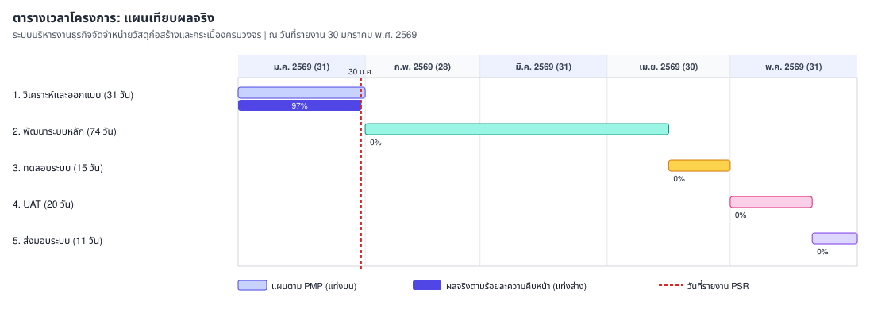

# รายงานความก้าวหน้าของโครงการ (Progress Status Report)

**ประเภท**: รายงานภายนอกสำหรับลูกค้า  
**ชื่อระบบงาน[TH]**: ระบบบริหารงานธุรกิจจัดจำหน่ายวัสดุก่อสร้างและกระเบื้องครบวงจร  
**ชื่อระบบงาน[EN]**: Rabbit Workflow System (RBWF)  
**วันที่รายงาน**: 30 มกราคม พ.ศ. 2569  
**ช่วงเวลาที่รายงาน**: 1 มกราคม 2569 - 30 มกราคม 2569

นำเสนอและลงนามในประชุมร่วมลูกค้าครั้งที่ 1/2026 ([RBWF_MOM_20260130](../RBWF_MOM/RBWF_MOM_20260130))

---

### 1. ความคืบหน้าของงานที่เสร็จสิ้นตามแผนการดำเนินงาน

| Task No | Task Description | Start Date | End Date | Progress | Duration (days) | Assigned To | Jan 2026 | Feb 2026 | Mar 2026 | Apr 2026 | May 2026 |
|---|---|---|---|---|---|---|---|---|---|---|---|
| 1 | วิเคราะห์และออกแบบระบบ (System Analysis & Design) | 01-Jan-2026 | 31-Jan-2026 | 97% | 31 | นายวีระ เนียมโภคะ (AN, TL) | ██████ | | | | |
| 2 | พัฒนาระบบหลัก (Core System Development) | 01-Feb-2026 | 15-Apr-2026 | 0% | 74 | นายปริญญา พงษ์ดนตรี (DES, PR) | | ██████ | ██████ | ███ | |
| 3 | การทดสอบระบบ (System Testing) | 16-Apr-2026 | 30-Apr-2026 | 0% | 15 | นายประกาศิต ทองนอก (TESTER) | | | | ███ | |
| 4 | การทดสอบการยอมรับจากผู้ใช้งาน (UAT) | 01-May-2026 | 20-May-2026 | 0% | 20 | นางสาวปวริศา จันทรสถาพร (PM) | | | | | ████ |
| 5 | ส่งมอบระบบและประเมินผล (System Delivery) | 21-May-2026 | 31-May-2026 | 0% | 11 | นางสาวปวริศา จันทรสถาพร (PM) | | | | | ██ |

**สรุป**: ในช่วงนี้ทีมจัดทำ SOW, PMP, PMPC และ IE แล้วประชุม Kickoff กับลูกค้า งานวิเคราะห์และออกแบบดำเนินการประมาณ 97% ตามแผน จะปิด Task 1 ในวันที่ 31 มกราคม พ.ศ. 2569 เอกสาร SRS ยังเป็นฉบับร่าง นัดทวนสอบภายในแล้ว Validation กลางเดือนกุมภาพันธ์ ยังไม่อนุมัติ SRS ในวันนี้

---

### 2. ปัญหาหรืออุปสรรคที่พบเจอในระหว่างการดำเนินโครงการ

| No | ปัญหาและอุปสรรค | แนวทางการแก้ปัญหา |
|---|---|---|
| 1 | ข้อกำหนดสิทธิ์ RBAC มีความหลากหลายตามแผนก | จัดทำบทบาทผู้ใช้และ Workflow ในร่าง SRS |
| 2 | โครงสร้างฐานข้อมูลสินค้ากระเบื้องซับซ้อน | ทบทวน ER Diagram ร่วมกับ TL ตาม Correction Register รายการ 001 |

---

### 3. เปรียบเทียบตารางต้นทุนเทียบกับงบประมาณที่ใช้จริง

| ประเภทต้นทุน | งบประมาณตามสัญญา (บาท) | ต้นทุนที่ใช้จริงสะสม (บาท) | หมายเหตุ |
|---|---|---|---|
| บุคลากร (วิเคราะห์และออกแบบ) | 62,000 | 60,000 | ใกล้ปิดงาน Task 1 |
| บุคลากร (พัฒนา / ทดสอบ / UAT / ส่งมอบ) | 248,000 | 0 | ยังไม่ถึงงวดงาน |
| เครื่องมือ เซิร์ฟเวอร์ และการสื่อสาร | 25,000 | 5,000 | ค่าบริการเดือนมกราคม |
| การทดสอบ QA และค่าเผื่อ | 15,000 | 0 | ยังไม่ใช้ |
| **รวม** | **350,000** | **65,000** | ยังอยู่ในงบประมาณ |

_สรุป: ยังอยู่ในงบประมาณ_

---

### 4. ความเสี่ยงที่เกิดขึ้นใหม่ และการแก้ไขหรือจัดการความเสี่ยงนั้น ๆ

| ความเสี่ยง | แนวทางแก้ไข | ระดับความเสี่ยง | โอกาสเกิด |
|---|---|---|---|
| R-01 การเปลี่ยนแปลงขอบเขต | ใช้กระบวนการ CR บันทึกที่ RBWF_CR ยังไม่มี CR | สูง | เฝ้าระวัง |
| R-02 ความไม่คุ้นเคยกับ Go / Svelte / Docker | ล็อกเวอร์ชันในเอกสาร IE | ปานกลาง | เฝ้าระวัง |
| R-03 การขาดแคลนบุคลากรทักษะเฉพาะ | วางแผนภาระงานตาม PMP | ปานกลาง | เฝ้าระวัง |
| R-04 ความปลอดภัย API และข้อมูล | เตรียม JWT HTTPS RBAC ตามเอกสาร IE | สูง | เฝ้าระวัง |
| R-05 ความล่าช้าพัฒนาหรือทดสอบ | ใช้ Docker Compose จำลองสภาพแวดล้อม | สูง | เฝ้าระวัง |
| R-06 การเปลี่ยนแปลงไลบรารี | ล็อกเวอร์ชันรันไทม์ในเอกสาร IE | ต่ำ | เฝ้าระวัง |
| R-07 การสื่อสารภายในทีม | มี Kickoff และรอบ MOM ภายใน/ภายนอก | ปานกลาง | ลดแล้ว |
| ความซับซ้อนโครงสร้างฐานข้อมูลสินค้า | ทบทวน ER Diagram และ Normalization ร่วมกับ TL | ปานกลาง | เกิดขึ้นใหม่ |

---

### 5. ปัญหาระหว่างดำเนินโครงการ

| เลขที่ | วันที่รายงาน | ผู้พบรายงาน | ปัญหาที่พบ | แนวทางการดำเนินการ |
|---|---|---|---|---|
| ISS-001 | 15/01/2026 | นายวีระ เนียมโภคะ | รูปแบบรายงานการเงิน PDF ต้องมีตรายางบริษัท | เพิ่ม Template Logo และ Stamp ในร่าง SRS |
| ISS-002 | 22/01/2026 | นายปริญญา พงษ์ดนตรี | ต้องระบุเวอร์ชัน Go runtime ชัดเจน | กำหนด Go 1.22+ ในเอกสาร IE |

---

### Change Request

(ไม่มีคำร้องขอเปลี่ยนแปลงในเดือนมกราคม)

---

**รายงานโดย**: นางสาวปวริศา จันทรสถาพร (Project Manager)  
**วันที่**: 30 มกราคม พ.ศ. 2569

---

### ผู้ลงนามรับรองรายงานความก้าวหน้า

| **ผู้แทนลูกค้า** | **ผู้จัดการโครงการ (PM)** | **หัวหน้าทีมวิเคราะห์ (TL)** | **นักออกแบบ/พัฒนา (DES/PR)** | **ผู้ทดสอบระบบ (TESTER)** |
|---|---|---|---|---|
|  (นายทิโนภาส อรไทวรรณ) |  (นางสาวปวริศา จันทรสถาพร) |  (นายวีระ เนียมโภคะ) |  (นายปริญญา พงษ์ดนตรี) |  (นายประกาศิต ทองนอก) |
