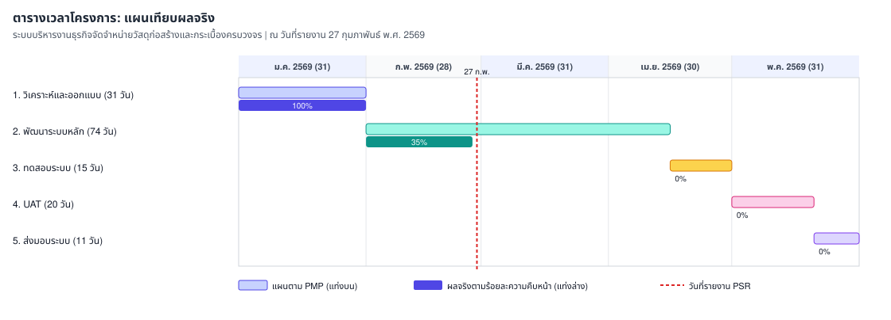

# รายงานความก้าวหน้าของโครงการ (Progress Status Report)

**ประเภท**: รายงานภายนอกสำหรับลูกค้า  
**ชื่อระบบงาน[TH]**: ระบบบริหารงานธุรกิจจัดจำหน่ายวัสดุก่อสร้างและกระเบื้องครบวงจร  
**ชื่อระบบงาน[EN]**: Rabbit Workflow System (RBWF)  
**วันที่รายงาน**: 27 กุมภาพันธ์ พ.ศ. 2569  
**ช่วงเวลาที่รายงาน**: 1 กุมภาพันธ์ 2569 - 27 กุมภาพันธ์ 2569

นำเสนอและลงนามในประชุมร่วมลูกค้าครั้งที่ 2/2026 ([RBWF_MOM_20260227](../RBWF_MOM/RBWF_MOM_20260227))

---

### 1. ความคืบหน้าของงานที่เสร็จสิ้นตามแผนการดำเนินงาน

| Task No | Task Description | Start Date | End Date | Progress | Duration (days) | Assigned To | Jan 2026 | Feb 2026 | Mar 2026 | Apr 2026 | May 2026 |
|---|---|---|---|---|---|---|---|---|---|---|---|
| 1 | วิเคราะห์และออกแบบระบบ (System Analysis & Design) | 01-Jan-2026 | 31-Jan-2026 | 100% | 31 | นายวีระ เนียมโภคะ (AN, TL) | ██████ | | | | |
| 2 | พัฒนาระบบหลัก (Core System Development) | 01-Feb-2026 | 15-Apr-2026 | 35% | 74 | นายปริญญา พงษ์ดนตรี (DES, PR) | | ██████ | ██████ | ███ | |
| 3 | การทดสอบระบบ (System Testing) | 16-Apr-2026 | 30-Apr-2026 | 0% | 15 | นายประกาศิต ทองนอก (TESTER) | | | | ███ | |
| 4 | การทดสอบการยอมรับจากผู้ใช้งาน (UAT) | 01-May-2026 | 20-May-2026 | 0% | 20 | นางสาวปวริศา จันทรสถาพร (PM) | | | | | ████ |
| 5 | ส่งมอบระบบและประเมินผล (System Delivery) | 21-May-2026 | 31-May-2026 | 0% | 11 | นางสาวปวริศา จันทรสถาพร (PM) | | | | | ██ |

**สรุป**: งานวิเคราะห์ปิดตามแผนแล้ว งานพัฒนาหลักประมาณ 35% สาธิตโมดูลคลังสินค้าและใบเสนอราคาบน Staging เอกสาร SRS v1.0 ผ่าน Validation วันที่ 5 กุมภาพันธ์ พ.ศ. 2569 และทวนสอบวันที่ 15 กุมภาพันธ์ พ.ศ. 2569 ลูกค้าอนุมัติเป็น baseline ในวันนี้

---

### 2. ปัญหาหรืออุปสรรคที่พบเจอในระหว่างการดำเนินโครงการ

| No | ปัญหาและอุปสรรค | แนวทางการแก้ปัญหา |
|---|---|---|
| 1 | ความซับซ้อนของการตรวจสอบสิทธิ์ผ่าน JWT และ RBAC Middleware | พัฒนาสถาปัตยกรรมแยกส่วน Middleware |
| 2 | Redis Connection Pool เต็มระหว่างทดสอบภายใน | ปรับ Max Open Connections ใน Go (ISS-003) |

---

### 3. เปรียบเทียบตารางต้นทุนเทียบกับงบประมาณที่ใช้จริง

| ประเภทต้นทุน | งบประมาณตามสัญญา (บาท) | ต้นทุนที่ใช้จริงสะสม (บาท) | หมายเหตุ |
|---|---|---|---|
| บุคลากร (วิเคราะห์และออกแบบ) | 62,000 | 62,000 | ปิดงวด Task 1 |
| บุคลากร (พัฒนาระบบหลัก) | 148,000 | 51,800 | ประมาณ 35% ของ Task 2 |
| บุคลากร (ทดสอบ / UAT / ส่งมอบ) | 100,000 | 0 | ยังไม่ถึงงวดงาน |
| เครื่องมือ เซิร์ฟเวอร์ และการสื่อสาร | 25,000 | 10,000 | สะสม 2 เดือน |
| การทดสอบ QA และค่าเผื่อ | 15,000 | 0 | ยังไม่ใช้ |
| **รวม** | **350,000** | **123,800** | ยังอยู่ในงบประมาณ |

_สรุป: ยังอยู่ในงบประมาณ_

---

### 4. ความเสี่ยงที่เกิดขึ้นใหม่ และการแก้ไขหรือจัดการความเสี่ยงนั้น ๆ

| ความเสี่ยง | แนวทางแก้ไข | ระดับความเสี่ยง | โอกาสเกิด |
|---|---|---|---|
| ประสิทธิภาพการค้นหาสินค้าเมื่อข้อมูลมาก | สร้าง Index บน MySQL และใช้ Redis cache | ปานกลาง | ปานกลาง |
| R-04 ความปลอดภัย API | แยก JWT และ RBAC Middleware | สูง | กำลังลด |
| R-01 การเปลี่ยนแปลงขอบเขต | ข้อเสนอกำไรขั้นต้นต้องยื่นเป็น CR ในเดือนมีนาคม | สูง | เฝ้าระวัง |

---

### 5. ปัญหาระหว่างดำเนินโครงการ

| เลขที่ | วันที่รายงาน | ผู้พบรายงาน | ปัญหาที่พบ | แนวทางการดำเนินการ |
|---|---|---|---|---|
| ISS-003 | 12/02/2026 | นายปริญญา พงษ์ดนตรี | Redis Connection Pool เต็มระหว่างทดสอบ | ปรับ Max Open Connections ใน Go |
| ISS-004 | 20/02/2026 | นายประกาศิต ทองนอก | การเรียงลำดับรายการสินค้าในคลัง | เพิ่มพารามิเตอร์ Sorting ใน REST API |

---

### Change Request

(ไม่มีคำร้องขอเปลี่ยนแปลงที่ยื่นในเดือนกุมภาพันธ์ อยู่ระหว่างรวบรวมข้อเสนอจากลูกค้าเรื่องรายงานกำไรขั้นต้น)

---

**รายงานโดย**: นางสาวปวริศา จันทรสถาพร (Project Manager)  
**วันที่**: 27 กุมภาพันธ์ พ.ศ. 2569

---

### ผู้ลงนามรับรองรายงานความก้าวหน้า

| **ผู้แทนลูกค้า** | **ผู้จัดการโครงการ (PM)** | **หัวหน้าทีมวิเคราะห์ (TL)** | **นักออกแบบ/พัฒนา (DES/PR)** | **ผู้ทดสอบระบบ (TESTER)** |
|---|---|---|---|---|
|  (นางษมาภรณ์ พงษ์ดนตรี) |  (นางสาวปวริศา จันทรสถาพร) |  (นายวีระ เนียมโภคะ) |  (นายปริญญา พงษ์ดนตรี) |  (นายประกาศิต ทองนอก) |
