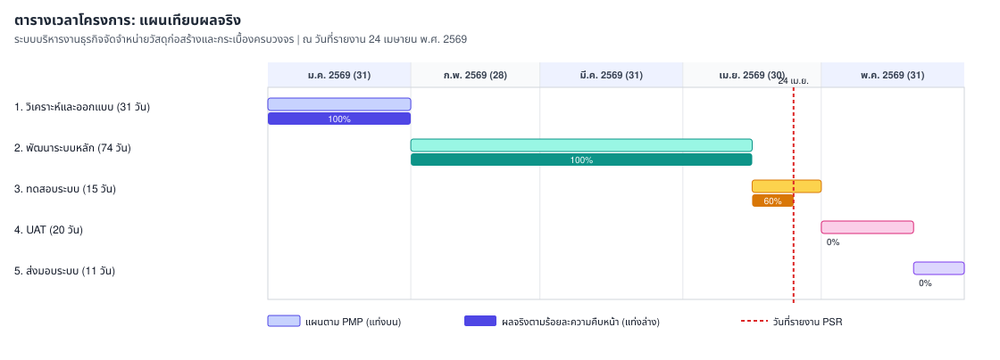

# รายงานความก้าวหน้าของโครงการ (Progress Status Report)

**ประเภท**: รายงานภายนอกสำหรับลูกค้า  
**ชื่อระบบงาน[TH]**: ระบบบริหารงานธุรกิจจัดจำหน่ายวัสดุก่อสร้างและกระเบื้องครบวงจร  
**ชื่อระบบงาน[EN]**: Rabbit Workflow System (RBWF)  
**วันที่รายงาน**: 24 เมษายน พ.ศ. 2569  
**ช่วงเวลาที่รายงาน**: 1 เมษายน 2569 - 24 เมษายน 2569

นำเสนอและลงนามในประชุมร่วมลูกค้าครั้งที่ 4/2026 ([RBWF_MOM_20260424](../RBWF_MOM/RBWF_MOM_20260424))

---

### 1. ความคืบหน้าของงานที่เสร็จสิ้นตามแผนการดำเนินงาน

| Task No | Task Description | Start Date | End Date | Progress | Duration (days) | Assigned To | Jan 2026 | Feb 2026 | Mar 2026 | Apr 2026 | May 2026 |
|---|---|---|---|---|---|---|---|---|---|---|---|
| 1 | วิเคราะห์และออกแบบระบบ (System Analysis & Design) | 01-Jan-2026 | 31-Jan-2026 | 100% | 31 | นายวีระ เนียมโภคะ (AN, TL) | ██████ | | | | |
| 2 | พัฒนาระบบหลัก (Core System Development) | 01-Feb-2026 | 15-Apr-2026 | 100% | 74 | นายปริญญา พงษ์ดนตรี (DES, PR) | | ██████ | ██████ | ███ | |
| 3 | การทดสอบระบบ (System Testing) | 16-Apr-2026 | 30-Apr-2026 | 60% | 15 | นายประกาศิต ทองนอก (TESTER) | | | | ███ | |
| 4 | การทดสอบการยอมรับจากผู้ใช้งาน (UAT) | 01-May-2026 | 20-May-2026 | 0% | 20 | นางสาวปวริศา จันทรสถาพร (PM) | | | | | ████ |
| 5 | ส่งมอบระบบและประเมินผล (System Delivery) | 21-May-2026 | 31-May-2026 | 0% | 11 | นางสาวปวริศา จันทรสถาพร (PM) | | | | | ██ |

**สรุป**: งานพัฒนาหลักปิดตามแผนวันที่ 15 เมษายน พ.ศ. 2569 System Testing เริ่มวันที่ 16 เมษายน พ.ศ. 2569 และ ณ วันนี้ดำเนินการประมาณ 60% **ยังไม่ปิดรอบทดสอบและยังไม่สรุป Test Report ว่าผ่าน 100%** จะปิดรอบวันที่ 30 เมษายน พ.ศ. 2569 RBWF-CR-02 Queue Display อนุมัติวันที่ 20 เมษายน พ.ศ. 2569 โดยไม่เพิ่มงบ นัด UAT วันที่ 01–20 พฤษภาคม พ.ศ. 2569

---

### 2. ปัญหาหรืออุปสรรคที่พบเจอในระหว่างการดำเนินโครงการ

| No | ปัญหาและอุปสรรค | แนวทางการแก้ปัญหา |
|---|---|---|
| 1 | หน้าจอการปรับสถานะช่างแสดงผลช้า | Optimize SQL Query และเพิ่ม Index (ISS-007) อยู่ระหว่างทดสอบซ้ำ |
| 2 | ผู้เข้าชมทั่วไปมองเห็นปุ่มลบ | เพิ่ม Directive ซ่อนปุ่มตามสิทธิ์ใน Svelte (ISS-008) |

---

### 3. เปรียบเทียบตารางต้นทุนเทียบกับงบประมาณที่ใช้จริง

| ประเภทต้นทุน | งบประมาณตามสัญญา (บาท) | ต้นทุนที่ใช้จริงสะสม (บาท) | หมายเหตุ |
|---|---|---|---|
| บุคลากร (วิเคราะห์และออกแบบ) | 62,000 | 62,000 | ปิดงวด Task 1 |
| บุคลากร (พัฒนาระบบหลัก) | 148,000 | 148,000 | ปิดงวด Task 2 รวม CR-02 โดยไม่เพิ่มงบ |
| บุคลากร (ทดสอบระบบ) | 22,500 | 13,500 | ประมาณ 60% ของ Task 3 |
| บุคลากร (UAT / ส่งมอบ) | 77,500 | 0 | เริ่มพฤษภาคม |
| เครื่องมือ เซิร์ฟเวอร์ และการสื่อสาร | 25,000 | 20,000 | สะสม 4 เดือน |
| การทดสอบ QA และค่าเผื่อ | 15,000 | 8,000 | ใช้ชุดเครื่องมือ QA ตามแผน |
| **รวม** | **350,000** | **251,500** | ยังอยู่ในงบประมาณ |

_สรุป: ยังอยู่ในงบประมาณ_

---

### 4. ความเสี่ยงที่เกิดขึ้นใหม่ และการแก้ไขหรือจัดการความเสี่ยงนั้น ๆ

| ความเสี่ยง | แนวทางแก้ไข | ระดับความเสี่ยง | โอกาสเกิด |
|---|---|---|---|
| ความพร้อมของเครื่องผู้ใช้งานฝั่งลูกค้าในช่วง UAT | จัดเตรียมคู่มือเบื้องต้นและสแตนด์บายทางเทคนิค | ต่ำ | ต่ำ |
| R-05 ความล่าช้าทดสอบหรือ UAT | กำหนดตาราง UAT รายโมดูล 01–20 พฤษภาคม พ.ศ. 2569 | สูง | เฝ้าระวัง |
| R-01 การเปลี่ยนแปลงขอบเขต | ติดตาม CR-02 Queue Display ใน RBWF_CR | สูง | เฝ้าระวัง |

---

### 5. ปัญหาระหว่างดำเนินโครงการ

| เลขที่ | วันที่รายงาน | ผู้พบรายงาน | ปัญหาที่พบ | แนวทางการดำเนินการ |
|---|---|---|---|---|
| ISS-007 | 18/04/2026 | นายประกาศิต ทองนอก | หน้าจอการปรับสถานะช่างแสดงผลช้า | Optimize SQL Query และเพิ่ม Index |
| ISS-008 | 22/04/2026 | นายปริญญา พงษ์ดนตรี | สิทธิ์ RBAC ผู้เข้าชมทั่วไปมองเห็นปุ่มลบ | เพิ่ม Directive ซ่อนปุ่มตามสิทธิ์ใน Svelte |

---

### Change Request

| CR ID | วันที่ยื่น | หัวข้อ | สถานะ |
|---|---|---|---|
| RBWF-CR-01 | 15 มีนาคม 2569 | Profit Analysis ในใบเสนอราคา | อนุมัติและดำเนินการแล้ว |
| RBWF-CR-02 | 20 เมษายน 2569 | หน้าจอ Queue Display สำหรับจอ TV คลังสินค้า | อนุมัติแล้ว ไม่เพิ่มงบประมาณ |

---

**รายงานโดย**: นางสาวปวริศา จันทรสถาพร (Project Manager)  
**วันที่**: 24 เมษายน พ.ศ. 2569

---

### ผู้ลงนามรับรองรายงานความก้าวหน้า

| **ผู้แทนลูกค้า** | **ผู้จัดการโครงการ (PM)** | **หัวหน้าทีมวิเคราะห์ (TL)** | **นักออกแบบ/พัฒนา (DES/PR)** | **ผู้ทดสอบระบบ (TESTER)** |
|---|---|---|---|---|
|  (นางษมาภรณ์ พงษ์ดนตรี) |  (นางสาวปวริศา จันทรสถาพร) |  (นายวีระ เนียมโภคะ) |  (นายปริญญา พงษ์ดนตรี) |  (นายประกาศิต ทองนอก) |
