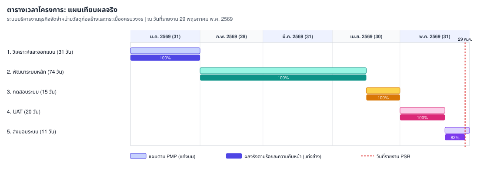

# รายงานความก้าวหน้าของโครงการ (Progress Status Report)

**ประเภท**: รายงานภายนอกสำหรับลูกค้า  
**ชื่อระบบงาน[TH]**: ระบบบริหารงานธุรกิจจัดจำหน่ายวัสดุก่อสร้างและกระเบื้องครบวงจร  
**ชื่อระบบงาน[EN]**: Rabbit Workflow System (RBWF)  
**วันที่รายงาน**: 29 พฤษภาคม พ.ศ. 2569  
**ช่วงเวลาที่รายงาน**: 1 พฤษภาคม 2569 - 29 พฤษภาคม 2569

นำเสนอและลงนามในประชุมร่วมลูกค้าครั้งที่ 5/2026 ([RBWF_MOM_20260529](../RBWF_MOM/RBWF_MOM_20260529))

---

### 1. ความคืบหน้าของงานที่เสร็จสิ้นตามแผนการดำเนินงาน

| Task No | Task Description | Start Date | End Date | Progress | Duration (days) | Assigned To | Jan 2026 | Feb 2026 | Mar 2026 | Apr 2026 | May 2026 |
|---|---|---|---|---|---|---|---|---|---|---|---|
| 1 | วิเคราะห์และออกแบบระบบ (System Analysis & Design) | 01-Jan-2026 | 31-Jan-2026 | 100% | 31 | นายวีระ เนียมโภคะ (AN, TL) | ██████ | | | | |
| 2 | พัฒนาระบบหลัก (Core System Development) | 01-Feb-2026 | 15-Apr-2026 | 100% | 74 | นายปริญญา พงษ์ดนตรี (DES, PR) | | ██████ | ██████ | ███ | |
| 3 | การทดสอบระบบ (System Testing) | 16-Apr-2026 | 30-Apr-2026 | 100% | 15 | นายประกาศิต ทองนอก (TESTER) | | | | ███ | |
| 4 | การทดสอบการยอมรับจากผู้ใช้งาน (UAT) | 01-May-2026 | 20-May-2026 | 100% | 20 | นางสาวปวริศา จันทรสถาพร (PM) | | | | | ████ |
| 5 | ส่งมอบระบบและประเมินผล (System Delivery) | 21-May-2026 | 31-May-2026 | 82% | 11 | นางสาวปวริศา จันทรสถาพร (PM) | | | | | ██ |

**สรุป**: UAT ปิดตามแผนวันที่ 20 พฤษภาคม พ.ศ. 2569 ลูกค้าลงนามรับมอบวันที่ 25 พฤษภาคม พ.ศ. 2569 (RBWF_VLD_20260525) งานส่งมอบประมาณ 82% จะปิดคลังเอกสารภายในวันที่ 31 พฤษภาคม พ.ศ. 2569 คำขอเปลี่ยนแปลงทั้งสองรายการปิดตามทะเบียน RBWF_CR แล้ว ทดสอบ Restore ตาม ISS-010 ผ่านเกณฑ์กู้คืนภายใน 1 ชั่วโมง

---

### 2. ปัญหาหรืออุปสรรคที่พบเจอในระหว่างการดำเนินโครงการ

| No | ปัญหาและอุปสรรค | แนวทางการแก้ปัญหา |
|---|---|---|
| 1 | การเตรียมความพร้อมผู้ใช้งานก่อนใช้งานจริง | ฝึกอบรมและส่งมอบคู่มือ SUD |
| 2 | การสำรองและกู้คืนข้อมูลก่อน Go-Live | ทดสอบ Restore สำเร็จตามเกณฑ์ 1 ชั่วโมง (ISS-010) จาก [โฟลเดอร์ Google Drive](https://drive.google.com/drive/folders/18E0MSSXUGmgzW8v-OFUDRGwLmIJXBSPX?usp=sharing) |

---

### 3. เปรียบเทียบตารางต้นทุนเทียบกับงบประมาณที่ใช้จริง

| ประเภทต้นทุน | งบประมาณตามสัญญา (บาท) | ต้นทุนที่ใช้จริงสะสม (บาท) | หมายเหตุ |
|---|---|---|---|
| บุคลากร (วิเคราะห์และออกแบบ) | 62,000 | 62,000 | ปิดงวด |
| บุคลากร (พัฒนาระบบหลัก) | 148,000 | 148,000 | ปิดงวด รวม CR โดยไม่เพิ่มงบ |
| บุคลากร (ทดสอบระบบ) | 22,500 | 22,500 | ปิดงวด |
| บุคลากร (UAT) | 50,000 | 50,000 | ปิดงวดวันที่ 20 พ.ค. |
| บุคลากร (ส่งมอบ) | 27,500 | 22,500 | ใกล้ปิด Task 5 |
| เครื่องมือ เซิร์ฟเวอร์ และการสื่อสาร | 25,000 | 25,000 | ครบ 5 เดือน |
| การทดสอบ QA และค่าเผื่อ | 15,000 | 8,000 | ค่าเผื่อ 7,000 ไม่ใช้ เพราะ CR ไม่เพิ่มงบ |
| **รวม** | **350,000** | **338,000** | ยังอยู่ในงบประมาณ |

_สรุป: ยังอยู่ในงบประมาณ_

---

### 4. ความเสี่ยงที่เกิดขึ้นใหม่ และการแก้ไขหรือจัดการความเสี่ยงนั้น ๆ

| ความเสี่ยง | แนวทางแก้ไข | ระดับความเสี่ยง | โอกาสเกิด |
|---|---|---|---|
| การโอนย้ายข้อมูลจริง | ทดสอบ Dry-Run Migration ก่อน Go-Live | ต่ำ | ต่ำ |
| การบำรุงรักษาระยะรับประกัน | ช่องทาง Helpdesk และ SLA ในเอกสาร MA | ต่ำ | ต่ำ |
| R-01 การเปลี่ยนแปลงขอบเขต | ปิด CR ตามทะเบียน RBWF_CR ก่อนส่งมอบ | สูง | ลดแล้ว |
| R-04 ความปลอดภัย Production | คง JWT HTTPS RBAC หลังส่งมอบ | สูง | เฝ้าระวังต่อเนื่อง |

---

### 5. ปัญหาระหว่างดำเนินโครงการ

| เลขที่ | วันที่รายงาน | ผู้พบรายงาน | ปัญหาที่พบ | แนวทางการดำเนินการ |
|---|---|---|---|---|
| ISS-009 | 15/05/2026 | นางษมาภรณ์ พงษ์ดนตรี | ปรับแต่งการตั้งชื่อหัวกระดาษในใบเสร็จ | อัปเดตไฟล์ Configuration |
| ISS-010 | 25/05/2026 | นายประกาศิต ทองนอก | การสำรองข้อมูลอัตโนมัติและทดสอบ Restore | ทดสอบ Restore สำเร็จตามเกณฑ์ 1 ชั่วโมง |

---

### Change Request

| CR ID | วันที่ยื่น | หัวข้อ | สถานะ |
|---|---|---|---|
| RBWF-CR-01 | 15 มีนาคม 2569 | Profit Analysis ในใบเสนอราคา | ปิดงานแล้ว |
| RBWF-CR-02 | 20 เมษายน 2569 | หน้าจอ Queue Display | ปิดงานแล้ว |

---

**รายงานโดย**: นางสาวปวริศา จันทรสถาพร (Project Manager)  
**วันที่**: 29 พฤษภาคม พ.ศ. 2569

---

### ผู้ลงนามรับรองรายงานความก้าวหน้า

| **ผู้แทนลูกค้า** | **ผู้จัดการโครงการ (PM)** | **หัวหน้าทีมวิเคราะห์ (TL)** | **นักออกแบบ/พัฒนา (DES/PR)** | **ผู้ทดสอบระบบ (TESTER)** |
|---|---|---|---|---|
|  (นางษมาภรณ์ พงษ์ดนตรี) |  (นางสาวปวริศา จันทรสถาพร) |  (นายวีระ เนียมโภคะ) |  (นายปริญญา พงษ์ดนตรี) |  (นายประกาศิต ทองนอก) |
