# เอกสาร การออกแบบระบบ (SOFTWARE DESIGN DOCUMENT - SDD)

**ชื่อระบบงาน[TH]**: ระบบบริหารงานธุรกิจจัดจำหน่ายวัสดุก่อสร้างและกระเบื้องครบวงจร  
**ชื่อระบบงาน[EN]**: Rabbit Workflow System (RBWF)  
**เวอร์ชัน**: 1.0  
**จัดทำโดย**: นายปริญญา พงษ์ดนตรี (DES, PR) / นายวีระ เนียมโภคะ (TL, AN)  
**วันที่อนุมัติเอกสาร**: 10 มีนาคม พ.ศ. 2569  

---

## ประวัติการจัดทำเอกสาร

| ลำดับ | เวอร์ชัน | รายละเอียดการดำเนินการ | ผู้ดำเนินการ | วันที่ดำเนินการ |
|---|---|---|---|---|
| 1 | 0.1 | ร่างเอกสารการออกแบบระบบและฐานข้อมูล | นายปริญญา พงษ์ดนตรี (DES, PR) | 01 มีนาคม พ.ศ. 2569 |
| 2 | 1.0 | อนุมัติเอกสารการออกแบบระบบ | นายวีระ เนียมโภคะ (TL, AN) | 10 มีนาคม พ.ศ. 2569 |

---

## สารบัญ

1. [ภาพรวมการออกแบบระบบ (System and Software Design Overview)](#1-ภาพรวมการออกแบบระบบ-system-and-software-design-overview)  
2. [การออกแบบระบบ (System Design)](#2-การออกแบบระบบ-system-design)  
   - 2.1 แนวคิดการออกแบบสถาปัตยกรรมและมาตรฐาน  
   - 2.2 รายละเอียดการออกแบบระบบ  
3. [การออกแบบซอฟต์แวร์ (Software Design)](#3-การออกแบบซอฟต์แวร์-software-design)  
   - 3.1 แนวคิดการออกแบบสถาปัตยกรรมและมาตรฐาน  
   - 3.2 รายละเอียดการออกแบบซอฟต์แวร์  
   - 3.3 รายละเอียดส่วนติดต่อ  
   - 3.4 การออกแบบข้อมูล  
4. [แผนภาพประกอบ (Diagrams)](#4-แผนภาพประกอบ-diagrams)  
5. [API Payload Specification](#5-api-payload-specification)  
6. [User Interface](#6-user-interface)  
7. [ข้อตกลงและการลงนามอนุมัติ](#7-ข้อตกลงและการลงนามอนุมัติ-sign-off-agreement)  

---

## 1. ภาพรวมการออกแบบระบบ (System and Software Design Overview)

**ระบบบริหารงานธุรกิจจัดจำหน่ายวัสดุก่อสร้างและกระเบื้องครบวงจร (Rabbit Workflow - RBWF)** ออกแบบเป็นระบบบริหารองค์กรแบบรวมศูนย์ (Modular Monolith Web Architecture) เพื่อให้พนักงานขาย ฝ่ายจัดซื้อ ฝ่ายคลังสินค้า ช่างตัด/เตรียมกระเบื้อง ฝ่ายการเงิน และผู้บริหาร ทำงานบนระบบเดียวกัน ครอบคลุมสต็อก ใบเสนอราคา ใบสั่งซื้อ งานช่างและคิวส่งของ บัญชีเงินสด และสิทธิ์ RBAC ตามเอกสาร SRS และ SOW

---

## 2. การออกแบบระบบ (System Design)

### 2.1 แนวคิดการออกแบบสถาปัตยกรรมและมาตรฐาน (Architecture Concept Design and Standard)

ระบบใช้สถาปัตยกรรม **Modular Monolith** ไม่แยกเป็น Microservices และไม่ใช้คิวข้อความแบบ RabbitMQ

- ผู้ใช้เข้าผ่านเว็บเบราว์เซอร์ (Svelte SPA)
- Nginx ทำ TLS termination และกระจายคำขอไปยังไฟล์หน้าเว็บกับ REST API
- Go REST API ตรวจสอบ JWT และ RBAC แล้วเข้าถึง MySQL, Redis และที่เก็บไฟล์
- WebSocket Hub ส่งสถานะคิวเตรียมสินค้าแบบเรียลไทม์
- ชุดส่งมอบทำงานใน Docker Compose ตามเอกสาร IE

### 2.2 รายละเอียดการออกแบบระบบ (System Detail Design)

โมดูลหลักสอดคล้องกับ SOW ข้อ 3.1–3.6:

- **สต็อกและสินค้า**: รายการกระเบื้อง รับเข้า-จ่ายออก แจ้งเตือนขั้นต่ำ
- **งานขาย**: RFQ, ใบเสนอราคา, อนุมัติตามมูลค่า, ค่าคอมมิชชัน
- **จัดซื้อ**: ใบสั่งซื้อ ซัพพลายเออร์ รับสินค้า ชำระเงินค่างวด
- **งานช่างและจัดส่ง**: มอบหมายงาน อัปโหลดรูป คิวเรียลไทม์ ใบส่งของ PDF
- **การเงิน**: สมุดเงินสด ค่าใช้จ่าย เบิกจ่าย เงินเดือน รายงานประจำเดือน
- **ผู้ใช้และสิทธิ์**: Users, Agents, Workers, Suppliers, RBAC, เปลี่ยนรหัสผ่าน

การเชื่อมต่อระหว่างหน้าเว็บกับเซิร์ฟเวอร์ใช้ **REST API (JSON)** และ **WebSocket** สำหรับคิว ไม่ใช้ Payment Gateway หรือ Mapping API

---

## 3. การออกแบบซอฟต์แวร์ (Software Design)

### 3.1 แนวคิดการออกแบบสถาปัตยกรรมและมาตรฐาน (Architecture Concept Design and Standard)

- **Frontend**: Vite + Svelte, Tailwind CSS, Svelte Store
- **Backend**: Go REST API, JWT Middleware, PDF generation
- **Database**: MySQL 8.0 (InnoDB, UTF8MB4)
- **Cache**: Redis 7.2+
- **Reverse proxy**: Nginx
- **Deployment**: Docker และ Docker Compose (`rbwf-nginx`, `rbwf-frontend`, `rbwf-api`, `rbwf-mysql`)

รายการไฟล์ส่วนประกอบอยู่ในเอกสาร SWC

### 3.2 รายละเอียดการออกแบบซอฟต์แวร์ (Software Detail Design)

จัดกลุ่มตามโมดูลธุรกิจของโครงการ (ไม่ใช้บทบาทลูกค้า/ผู้เก็บขยะของระบบตัวอย่าง)

#### 3.2.1 คลังสินค้าและสต็อก (Stock)

| Design ID | รายละเอียดการออกแบบ | SRS |
|---|---|---|
| **DES-STK-01** | หน้าจัดการหมวดหมู่และรายการสินค้ากระเบื้อง ระบุขนาด เกรด สี ราคา และตำแหน่งจัดเก็บ | REQ-STK-01 |
| **DES-STK-02** | หน้าปรับปรุงยอดรับเข้า-จ่ายออก และบันทึกประวัติ Stock Adjust | REQ-STK-02 |
| **DES-STK-04** | การแจ้งเตือนสินค้าต่ำกว่าเกณฑ์ในระบบและทางอีเมล | REQ-STK-04 |

#### 3.2.2 งานขาย ใบเสนอราคา และคอมมิชชัน (Sales)

| Design ID | รายละเอียดการออกแบบ | SRS |
|---|---|---|
| **DES-QTO-01** | หน้าบันทึกและติดตาม RFQ จากลูกค้า | REQ-QTO-01 |
| **DES-QTO-02** | หน้าสร้างใบเสนอราคา คำนวณส่วนลด กำไร และออก PDF | REQ-QTO-02 |
| **DES-QTO-03** | เวิร์กโฟลว์อนุมัติใบเสนอราคาตามมูลค่า | REQ-QTO-03 |
| **DES-QTO-04** | บันทึกค่าคอมมิชชันและประวัติการจ่าย | REQ-QTO-04 |

#### 3.2.3 ใบสั่งซื้อและซัพพลายเออร์ (Purchasing)

| Design ID | รายละเอียดการออกแบบ | SRS |
|---|---|---|
| **DES-PO-01** | หน้าสร้างใบสั่งซื้อและออก PO PDF | REQ-PO-01 |
| **DES-PO-02** | หน้าบันทึกรับสินค้าพร้อมรูปถ่ายและเอกสารกำกับ | REQ-PO-02 |
| **DES-PO-03** | บันทึกชำระเงินค่างวด ใบกำกับภาษี และใบเสร็จ | REQ-PO-03 |
| **DES-PO-04** | หน้าจัดการข้อมูลซัพพลายเออร์และประวัติการสั่งซื้อ | REQ-PO-04 |

#### 3.2.4 งานช่าง คิว และใบส่งของ (Worker & Delivery)

| Design ID | รายละเอียดการออกแบบ | SRS |
|---|---|---|
| **DES-WRK-01** | หน้ามอบหมายงานช่างและติดตามสถานะ | REQ-WRK-01 |
| **DES-WRK-02** | อัปโหลดรูปภาพผลงานหลังทำเสร็จ | REQ-WRK-02 |
| **DES-WRK-03** | หน้า Queue Display เรียลไทม์ผ่าน WebSocket สำหรับจอคลัง | REQ-WRK-03 |
| **DES-WRK-04** | ออก Delivery Note PDF และแจ้งเตือนการจัดส่ง | REQ-WRK-04 |

#### 3.2.5 การเงินและสิทธิ์ผู้ใช้ (Finance & RBAC)

| Design ID | รายละเอียดการออกแบบ | SRS |
|---|---|---|
| **DES-FIN-01** | หน้าสมุดบัญชีเงินสดรับ-จ่ายและยอดคงเหลือ | REQ-FIN-01 |
| **DES-FIN-02** | หน้าค่าใช้จ่ายองค์กรและคำขอเบิกจ่าย | REQ-FIN-02 |
| **DES-FIN-03** | หน้าคำนวณเงินเดือนและออกใบเสร็จ PDF | REQ-FIN-03 |
| **DES-FIN-04** | หน้ารายงานสรุปผลการดำเนินงานประจำเดือน | REQ-FIN-04 |
| **DES-SEC-01** | หน้าเข้าสู่ระบบ จัดการผู้ใช้ บทบาท และเปลี่ยนรหัสผ่าน | REQ-SEC-01 |

### 3.3 รายละเอียดส่วนติดต่อ (Interface Detail Design)

- การเชื่อมต่อหน้าเว็บกับเซิร์ฟเวอร์ใช้ **REST API** ส่งข้อมูล **JSON** ผ่าน HTTPS
- คิวเตรียมสินค้าใช้ **WebSocket** ที่ `/api/v1/ws/queue`
- แจ้งเตือนสต็อกขั้นต่ำส่งออกทาง **SMTP / อีเมล**
- ส่วนติดต่อผู้ใช้จัดวางด้วย **Tailwind CSS** บน Svelte

### 3.4 การออกแบบข้อมูล (Data Element Design)

ข้อมูลหลักเก็บใน **MySQL** แผนภาพความสัมพันธ์อยู่ในข้อ 4.8 และรายละเอียดคอลัมน์อยู่ในข้อ 4.9

---

## 4. แผนภาพประกอบ (Diagrams)

### 4.1 แผนภาพ Component (Component Diagram)

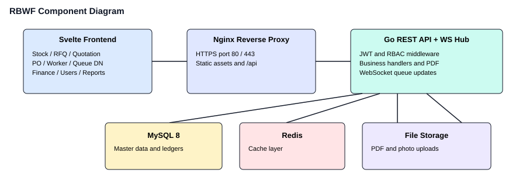

### 4.2 แผนภาพ Class (Class Diagram)

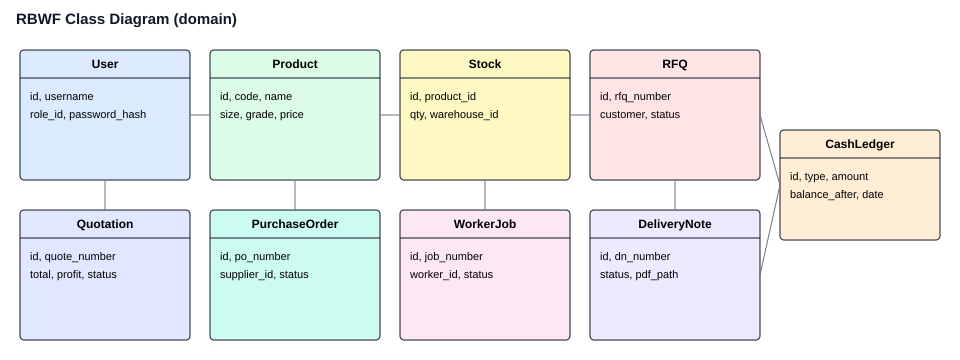

### 4.3 แผนภาพ Sequence (Sequence Diagram)

ลำดับตัวอย่าง: พนักงานขายสร้างใบเสนอราคา ระบบบันทึก MySQL สร้าง PDF แล้วอนุมัติตามมูลค่า

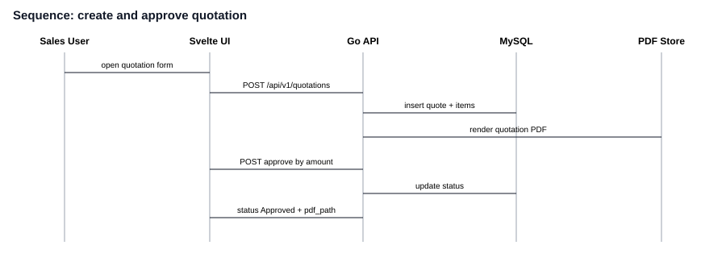

### 4.4 แผนภาพ Deployment (Deployment Diagram)

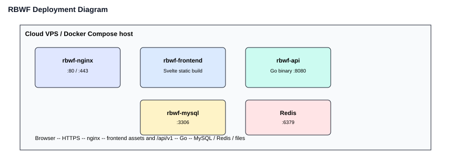

### 4.5 แผนภาพ Use Case (Use Case Diagram)

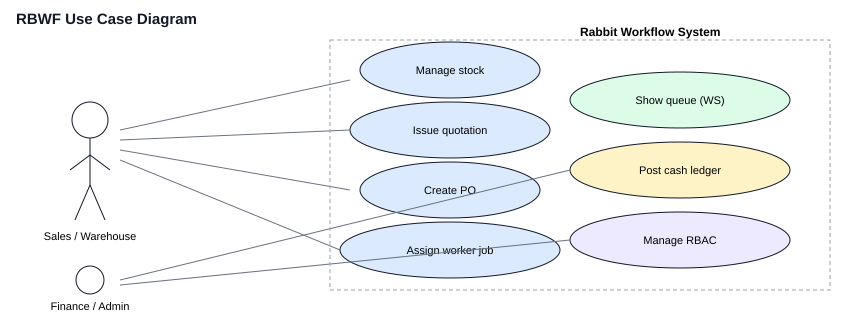

### 4.6 แผนภาพการออกแบบ API (API Design Diagram)

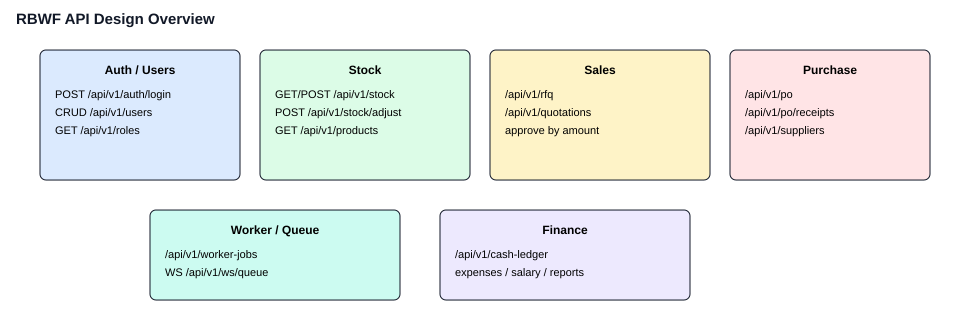

### 4.7 แผนภาพการไหลของผู้ใช้ (User Flow Diagram)

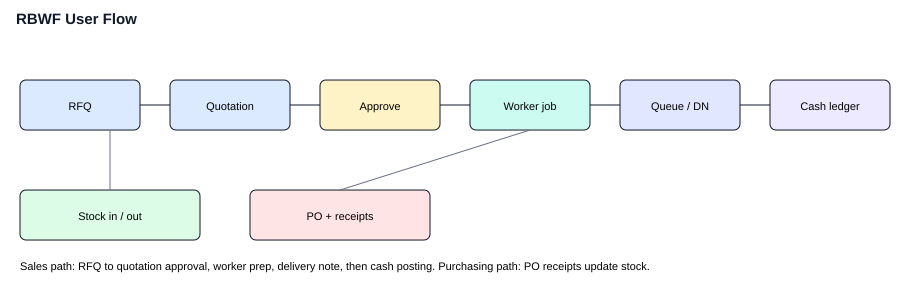

### 4.8 แผนภาพ Enhanced Entity-Relationship (EER Model)

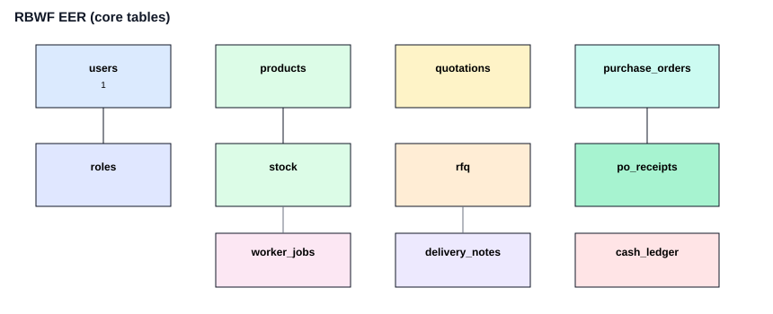

### 4.9 Data Dictionary

| Table Name | Column Name | Data Type | Description | Constraints |
|---|---|---|---|---|
| **users** | id | INT | รหัสผู้ใช้ | PK, Auto Increment |
| users | username | VARCHAR(100) | ชื่อเข้าสู่ระบบ | NOT NULL, Unique |
| users | password_hash | VARCHAR(255) | รหัสผ่านแบบ bcrypt | NOT NULL |
| users | full_name | VARCHAR(150) | ชื่อ-นามสกุล | NOT NULL |
| users | email | VARCHAR(150) | อีเมล | |
| users | role_id | INT | บทบาท | FK → roles(id) |
| **roles** | id | INT | รหัสบทบาท | PK |
| roles | role_name | VARCHAR(80) | ชื่อบทบาท | NOT NULL |
| roles | permissions_json | TEXT | สิทธิ์เมนู/API | |
| **permissions** | id | INT | รหัสสิทธิ์ | PK |
| permissions | code | VARCHAR(80) | รหัสสิทธิ์ | Unique |
| permissions | module_name | VARCHAR(80) | โมดูล | |
| **product_categories** | id | INT | รหัสหมวด | PK |
| product_categories | name | VARCHAR(120) | ชื่อหมวดสินค้า | NOT NULL |
| **products** | id | INT | รหัสสินค้า | PK |
| products | code | VARCHAR(50) | รหัสกระเบื้อง | Unique |
| products | name | VARCHAR(200) | ชื่อสินค้า | NOT NULL |
| products | category_id | INT | หมวด | FK → product_categories(id) |
| products | size | VARCHAR(50) | ขนาด | |
| products | grade | VARCHAR(50) | เกรด | |
| products | price | DECIMAL(12,2) | ราคา | |
| products | alert_level | INT | จุดแจ้งเตือนสต็อก | |
| **stock** | id | INT | รหัสแถวสต็อก | PK |
| stock | product_id | INT | สินค้า | FK → products(id) |
| stock | warehouse_id | INT | คลัง | NOT NULL |
| stock | quantity | DECIMAL(12,2) | จำนวนคงเหลือ | NOT NULL |
| **stock_adjustments** | id | INT | รหัสปรับปรุง | PK |
| stock_adjustments | product_id | INT | สินค้า | FK → products(id) |
| stock_adjustments | adjust_type | VARCHAR(20) | รับเข้า / จ่ายออก | NOT NULL |
| stock_adjustments | qty_change | DECIMAL(12,2) | จำนวนที่เปลี่ยน | NOT NULL |
| stock_adjustments | reason | VARCHAR(255) | เหตุผล | |
| **rfq** | id | INT | รหัส RFQ | PK |
| rfq | rfq_number | VARCHAR(40) | เลขที่คำขอ | Unique |
| rfq | customer_name | VARCHAR(200) | ลูกค้า | NOT NULL |
| rfq | status | VARCHAR(30) | สถานะ | NOT NULL |
| **quotations** | id | INT | รหัสใบเสนอราคา | PK |
| quotations | quote_number | VARCHAR(40) | เลขที่เอกสาร | Unique |
| quotations | customer_name | VARCHAR(200) | ลูกค้า | NOT NULL |
| quotations | total_amount | DECIMAL(12,2) | ยอดรวม | |
| quotations | profit_margin | DECIMAL(8,2) | อัตรากำไร | |
| quotations | status | VARCHAR(30) | Draft / Pending / Approved | |
| quotations | pdf_path | VARCHAR(255) | ไฟล์ PDF | |
| **purchase_orders** | id | INT | รหัส PO | PK |
| purchase_orders | po_number | VARCHAR(40) | เลขที่ PO | Unique |
| purchase_orders | supplier_id | INT | ซัพพลายเออร์ | FK |
| purchase_orders | total_price | DECIMAL(12,2) | ยอดรวม | |
| purchase_orders | payment_status | VARCHAR(30) | สถานะชำระเงิน | |
| purchase_orders | pdf_path | VARCHAR(255) | ไฟล์ PO PDF | |
| **po_receipts** | id | INT | รหัสรับสินค้า | PK |
| po_receipts | po_id | INT | PO | FK → purchase_orders(id) |
| po_receipts | receipt_number | VARCHAR(40) | เลขที่รับ | |
| po_receipts | received_date | DATE | วันที่รับ | |
| po_receipts | photo_urls | TEXT | รูป/เอกสารกำกับ | |
| **workers** | id | INT | รหัสช่าง | PK |
| workers | name | VARCHAR(150) | ชื่อช่าง | NOT NULL |
| workers | skill | VARCHAR(100) | ทักษะ | |
| workers | status | VARCHAR(30) | พร้อมงาน / ไม่ว่าง | |
| **worker_jobs** | id | INT | รหัสงาน | PK |
| worker_jobs | job_number | VARCHAR(40) | เลขที่งาน | Unique |
| worker_jobs | worker_id | INT | ช่าง | FK → workers(id) |
| worker_jobs | product_id | INT | สินค้า | FK → products(id) |
| worker_jobs | qty | DECIMAL(12,2) | จำนวน | |
| worker_jobs | status | VARCHAR(30) | สถานะงาน | |
| worker_jobs | photo_path | VARCHAR(255) | รูปผลงาน | |
| **delivery_notes** | id | INT | รหัส DN | PK |
| delivery_notes | dn_number | VARCHAR(40) | เลขที่ใบส่งของ | Unique |
| delivery_notes | customer_name | VARCHAR(200) | ผู้รับ | |
| delivery_notes | address | VARCHAR(255) | ที่อยู่จัดส่ง | |
| delivery_notes | status | VARCHAR(30) | สถานะคิว/จัดส่ง | |
| delivery_notes | pdf_path | VARCHAR(255) | ไฟล์ DN PDF | |
| **cash_ledger** | id | INT | รหัสรายการเงินสด | PK |
| cash_ledger | transaction_type | VARCHAR(20) | รับ / จ่าย | NOT NULL |
| cash_ledger | amount | DECIMAL(12,2) | จำนวนเงิน | NOT NULL |
| cash_ledger | balance_after | DECIMAL(12,2) | ยอดคงเหลือหลังรายการ | |
| cash_ledger | note | VARCHAR(255) | หมายเหตุ | |
| cash_ledger | date | DATE | วันที่ | NOT NULL |
| **expenses** | id | INT | รหัสค่าใช้จ่าย | PK |
| expenses | title | VARCHAR(200) | รายการ | NOT NULL |
| expenses | category | VARCHAR(80) | หมวด | |
| expenses | amount | DECIMAL(12,2) | จำนวนเงิน | NOT NULL |
| expenses | date | DATE | วันที่ | |
| expenses | receipt_photo | VARCHAR(255) | หลักฐาน | |

---

## 5. API Payload Specification

Endpoint หลักอยู่ภายใต้ `/api/v1` ต้องส่ง JWT ยกเว้นการล็อกอิน

### 5.1 Authentication

**POST** `/api/v1/auth/login`

Request:

```json
{
  "username": "sales01",
  "password": "********"
}
```

Response `200`:

```json
{
  "token": "eyJhbGciOiJIUzI1NiIsInR5cCI6IkpXVCJ9...",
  "full_name": "Somchai Sales",
  "role": "sales"
}
```

- `401` รหัสผ่านไม่ถูกต้อง

### 5.2 Stock

**POST** `/api/v1/stock` ปรับยอด (Stock Adjust)

Request:

```json
{
  "product_id": 101,
  "adjust_type": "IN",
  "qty_change": 50,
  "reason": "PO receipt"
}
```

Response `200`:

```json
{
  "product_id": 101,
  "quantity": 320,
  "message": "Stock updated"
}
```

### 5.3 Quotations

**POST** `/api/v1/quotations`

Request:

```json
{
  "customer_name": "ABC Construction",
  "items": [
    { "product_id": 101, "qty": 20, "unit_price": 350, "discount_pct": 5 }
  ]
}
```

Response `201`:

```json
{
  "quote_number": "QT-2026-0042",
  "total_amount": 6650,
  "profit_margin": 18.5,
  "status": "PENDING",
  "pdf_path": "/files/quotations/QT-2026-0042.pdf"
}
```

### 5.4 Purchase Orders

**POST** `/api/v1/po`

Request:

```json
{
  "supplier_id": 12,
  "items": [
    { "product_id": 101, "qty": 100, "unit_price": 280 }
  ]
}
```

Response `201`:

```json
{
  "po_number": "PO-2026-0018",
  "total_price": 28000,
  "payment_status": "UNPAID",
  "pdf_path": "/files/po/PO-2026-0018.pdf"
}
```

### 5.5 Worker Jobs and Queue

**POST** `/api/v1/worker-jobs`

Request:

```json
{
  "worker_id": 7,
  "product_id": 101,
  "qty": 20
}
```

Response `201`:

```json
{
  "job_number": "WJ-2026-0091",
  "status": "ASSIGNED"
}
```

**GET** `/api/v1/ws/queue` — WebSocket สำหรับหน้า Queue Display เมื่อสถานะงานเปลี่ยน เซิร์ฟเวอร์ส่งเหตุการณ์ JSON เช่น `{ "job_number": "WJ-2026-0091", "status": "DONE" }`

### 5.6 Cash Ledger

**POST** `/api/v1/cash-ledger`

Request:

```json
{
  "transaction_type": "IN",
  "amount": 6650,
  "note": "Quotation QT-2026-0042 collected",
  "date": "2026-04-10"
}
```

Response `201`:

```json
{
  "id": 880,
  "balance_after": 125400.00
}
```

---

## 6. User Interface

เก็บไฟล์ภาพหน้าจอที่ `LOGO/sdd/` ชื่อตามตาราง ถ่ายจากระบบจริงความกว้างประมาณ 1280px อย่าใส่รหัสผ่านจริงในหน้าล็อกอิน

#### 6.1 สต็อกและสิทธิ์

| Design ID | หน้าในระบบ | ไฟล์ภาพ |
|---|---|---|
| **DES-SEC-01** | เข้าสู่ระบบ | 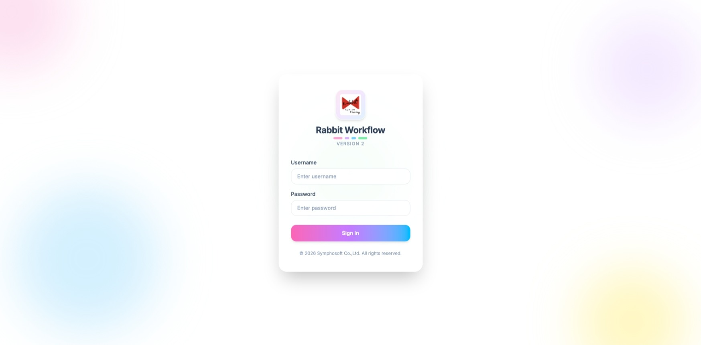 |
| **DES-SEC-01** | UserManagement / RoleManagement | 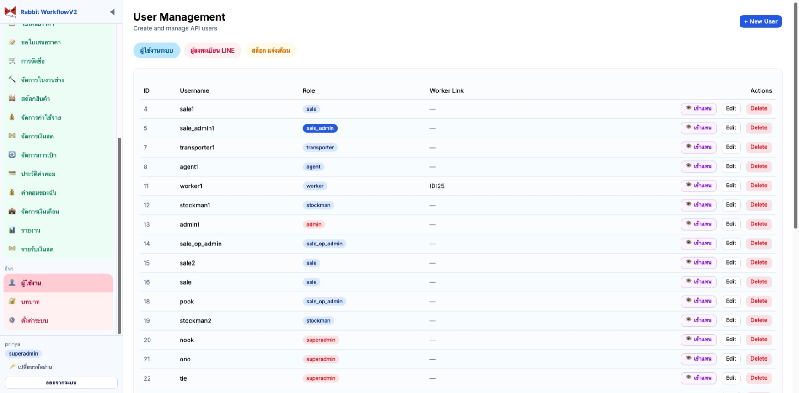 |
| **DES-STK-01 / DES-STK-02** | StockManagement.svelte | 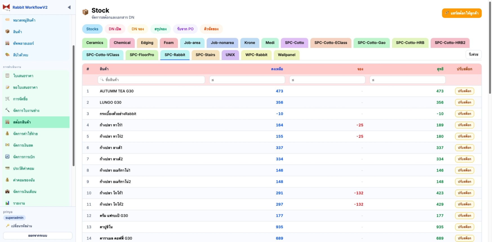 |

#### 6.2 งานขายและจัดซื้อ

| Design ID | หน้าในระบบ | ไฟล์ภาพ |
|---|---|---|
| **DES-QTO-01** | RFQPage.svelte | 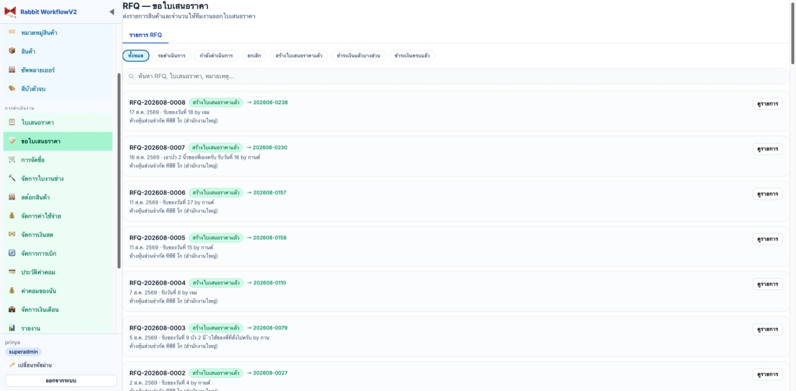 |
| **DES-QTO-02 / DES-QTO-03** | QuotationManagement.svelte | 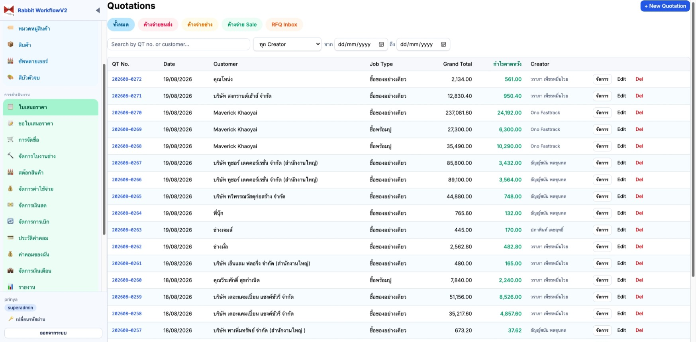 |
| **DES-PO-01 / DES-PO-02** | PurchaseOrdersPage.svelte | 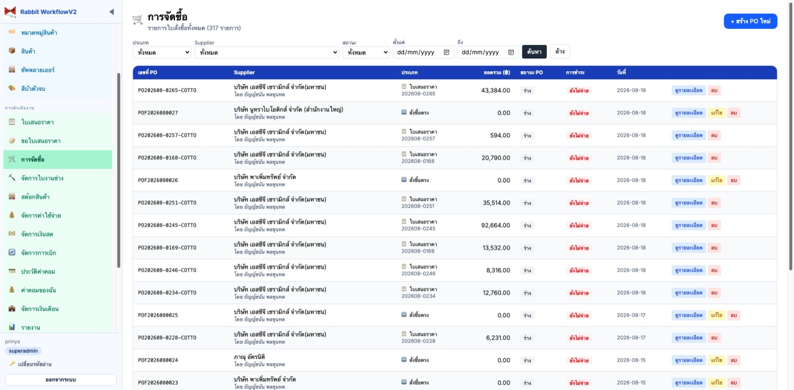 |
| **DES-PO-04** | SuppliersPage.svelte | 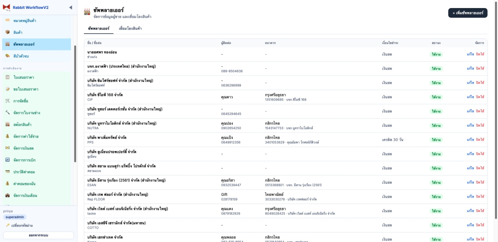 |

#### 6.3 งานช่าง การเงิน และรายงาน

| Design ID | หน้าในระบบ | ไฟล์ภาพ |
|---|---|---|
| **DES-WRK-01 / DES-WRK-02** | WorkerJobsPage.svelte | 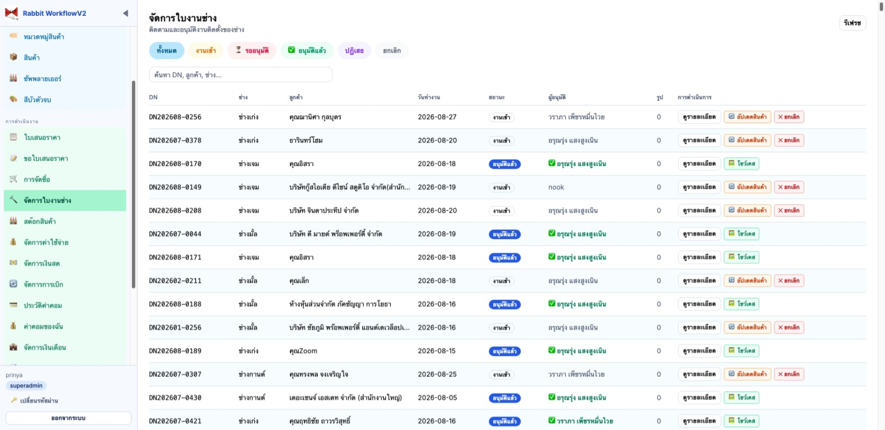 |
| **DES-WRK-03** | QueueDisplayPage.svelte | 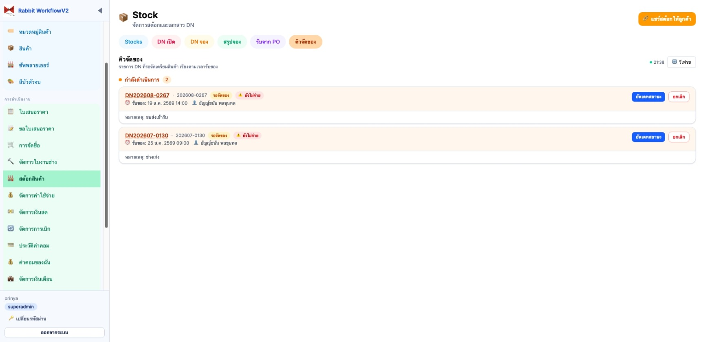 |
| **DES-FIN-01** | CashManagementPage.svelte | 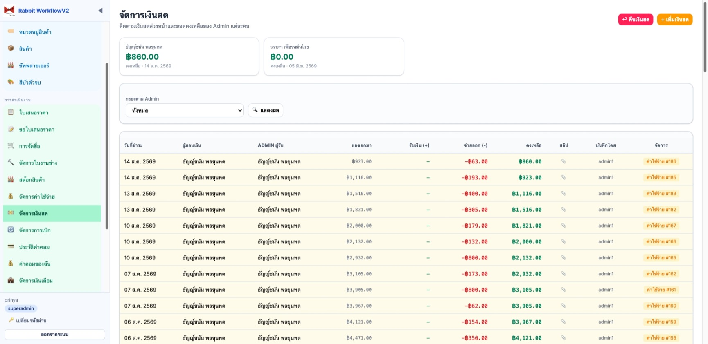 |
| **DES-FIN-02** | ExpensesPage.svelte | 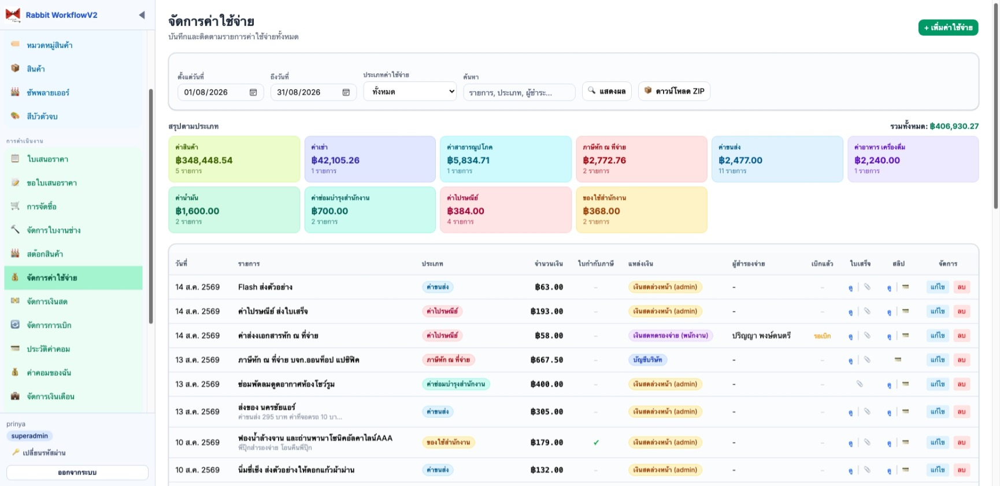 |
| **DES-FIN-03** | SalaryPage.svelte | 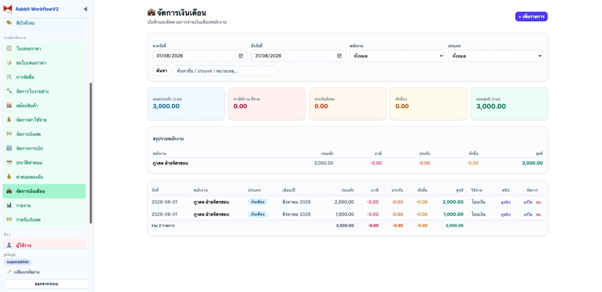 |
| **DES-FIN-04** | ReportsPage.svelte | 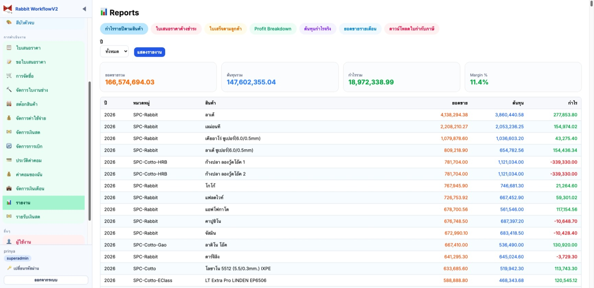 |

---

## 7. ข้อตกลงและการลงนามอนุมัติ (Sign-off Agreement)

 - [x] อนุมัติ  
 - [ ] ไม่อนุมัติ  

<br/>

| **ผู้จัดทำ (Prepared By)** | **ผู้ทบทวน / สอบทาน (Reviewed By)** | **ผู้ว่าจ้าง / ลูกค้า (Customer Approver)** |
|---|---|---|
| <br/>________________________________________ | <br/>________________________________________ | <br/>________________________________________ |
| **(นายปริญญา พงษ์ดนตรี)** | **(นายวีระ เนียมโภคะ)** | **(นางษมาภรณ์ พงษ์ดนตรี)** |
| ผู้ออกแบบและพัฒนา (DES, PR) | หัวหน้าทีมวิเคราะห์ (TL, AN) | ผู้มีอำนาจลงนาม |
| โครงการ RABBIT WORKFLOW (RBWF) | โครงการ RABBIT WORKFLOW (RBWF) | **บริษัท ซิมโฟร์ซอฟท์ จำกัด** |
| วันที่: 10 มีนาคม พ.ศ. 2569 | วันที่: 10 มีนาคม พ.ศ. 2569 | วันที่: 10 มีนาคม พ.ศ. 2569 |
