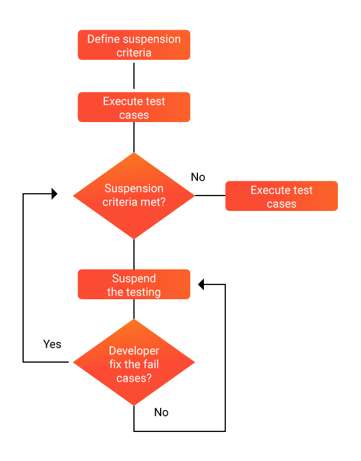

# Test Case and Test Procedures Document

**ระบบบริหารงานธุรกิจจัดจำหน่ายวัสดุก่อสร้างและกระเบื้องครบวงจร (Rabbit Workflow System)**

**ชื่อระบบงาน[TH]**: ระบบบริหารงานธุรกิจจัดจำหน่ายวัสดุก่อสร้างและกระเบื้องครบวงจร  
**ชื่อระบบงาน[EN]**: Rabbit Workflow System (RBWF)

**เวอร์ชัน**: 1.0  
**จัดทำโดย**: นายวีระ เนียมโภคะ (TL)  
**วันที่อนุมัติเอกสาร**: 10 เมษายน พ.ศ. 2569

---

## ประวัติการจัดทำเอกสาร

| ลำดับ | เวอร์ชัน | รายละเอียดการดำเนินการ | ผู้ดำเนินการ | วันที่ดำเนินการ |
|---|---|---|---|---|
| 1 | 0.1 | จัดทำเอกสาร Test Case and Test Procedures | นายวีระ เนียมโภคะ (TL) | 05 เมษายน พ.ศ. 2569 |
| 2 | 1.0 | อนุมัติเอกสาร Test Case and Test Procedures | นางสาวปวริศา จันทรสถาพร (PM) | 10 เมษายน พ.ศ. 2569 |

---

## แผนการทดสอบ [ TEST PLAN ]

---

## รายละเอียดการทดสอบ

เอกสารนี้กำหนดขั้นตอนและเงื่อนไขการทดสอบเท่านั้น ไม่บันทึกผลการทดสอบ ผลการทดสอบอยู่ที่เอกสารรายงานผลการทดสอบซอฟต์แวร์ (TR)

ไม่มี **TC-STK-03** เพราะเป็นฟังก์ชัน Edging ที่ตัดออกจากขอบเขตแล้ว

| TEST CASE ID | สรุปสาระสำคัญความต้องการของระบบ | Test Conditions | ความคาดหวัง | สถานะ | หมายเหตุ |
|---|---|---|---|---|---|
| TC-STK-01 | ระบบสามารถเพิ่ม แก้ไข และลบหมวดหมู่และรายการสินค้ากระเบื้อง พร้อมระบุขนาด เกรด สี ราคา และตำแหน่งจัดเก็บ | ตรวจสอบว่าระบบสามารถบันทึกรายการสินค้ากระเบื้องใหม่และแก้ไขหรือลบรายการได้ | ข้อมูลสินค้าถูกบันทึก แก้ไข หรือลบได้ถูกต้อง และสต็อกเริ่มต้นถูกต้อง |  |  |
| TC-STK-02 | ระบบสามารถบันทึกรับเข้า-จ่ายออกสต็อกกระเบื้องและปรับปรุงยอด (Stock Adjust) | ตรวจสอบว่าการรับเข้า จ่ายออก และการปรับปรุงยอดสต็อกคำนวณยอดคงเหลือใหม่ได้ | ยอดคงเหลือถูกต้อง และมีประวัติการปรับสต็อก |  |  |
| TC-STK-04 | ระบบสามารถส่งการแจ้งเตือนสินค้าคงคลังต่ำกว่าเกณฑ์ (Stock Notification) ผ่านระบบและอีเมล | ตรวจสอบว่าเมื่อยอดสินค้าต่ำกว่าเกณฑ์ที่กำหนด ระบบส่งการแจ้งเตือนในระบบและอีเมล | ผู้รับที่กำหนดได้รับการแจ้งเตือนสินค้าต่ำกว่าเกณฑ์ |  |  |
| TC-QTO-01 | ระบบสามารถบันทึกและติดตามคำขอใบเสนอราคา (RFQ) จากลูกค้า | ตรวจสอบว่าระบบสามารถสร้างรายการ RFQ และติดตามสถานะได้ | รายการ RFQ ถูกบันทึกและแสดงสถานะได้ถูกต้อง |  |  |
| TC-QTO-02 | ระบบสามารถสร้างใบเสนอราคา (Quotation) คำนวณส่วนลด กำไรขั้นต้น (Profit Analysis) และออก PDF | ตรวจสอบว่าการสร้างใบเสนอราคาคำนวณราคารวม ส่วนลด กำไร และออกไฟล์ PDF ได้ | ยอดคำนวณถูกต้อง และได้เอกสาร Quotation PDF |  |  |
| TC-QTO-03 | ระบบมีเวิร์กโฟลว์การอนุมัติใบเสนอราคาตามมูลค่าอนุมัติ | ตรวจสอบว่าการอนุมัติใบเสนอราคาตามมูลค่าเปลี่ยนสถานะตามเวิร์กโฟลว์ | สถานะใบเสนอราคาเปลี่ยนตามขั้นตอนอนุมัติที่กำหนด |  |  |
| TC-QTO-04 | ระบบสามารถคำนวณและบันทึกประวัติการจ่ายค่าคอมมิชชันสำหรับพนักงานขาย | ตรวจสอบว่าการคำนวณค่าคอมมิชชันและประวัติการจ่ายถูกบันทึก | ยอดคอมมิชชันและประวัติการจ่ายครบถ้วนถูกต้อง |  |  |
| TC-PO-01 | ระบบสามารถสร้างและออกใบสั่งซื้อ (PO PDF) ส่งไปยังซัพพลายเออร์ | ตรวจสอบว่าการสร้างใบสั่งซื้อออกเอกสาร PO PDF และเปลี่ยนสถานะเป็น Pending Receipt | ได้ไฟล์ PO PDF และสถานะถูกต้อง |  |  |
| TC-PO-02 | ระบบสามารถบันทึกการรับสินค้า (PO Receipts) พร้อมอัปโหลดรูปภาพและเอกสารกำกับ | ตรวจสอบว่าการรับสินค้าบันทึกยอดเข้าคลังและไฟล์แนบได้ | ยอดรับเข้าและไฟล์แนบถูกบันทึกครบ |  |  |
| TC-PO-03 | ระบบสามารถบันทึกการชำระเงินค่างวด PO ใบกำกับภาษี และเอกสารใบเสร็จ | ตรวจสอบว่าการบันทึกชำระเงินค่างวดและเอกสารภาษีถูกต้อง | สถานะชำระเงินและเอกสารภาษีครบถ้วน |  |  |
| TC-PO-04 | ระบบจัดการข้อมูลซัพพลายเออร์และประวัติการสั่งซื้อ | ตรวจสอบว่าสามารถเพิ่มและแก้ไขข้อมูลซัพพลายเออร์และเชื่อมโยงกับ PO ได้ | ประวัติซัพพลายเออร์และการสั่งซื้อเชื่อมโยงกับ PO ได้ถูกต้อง |  |  |
| TC-WRK-01 | ระบบสามารถมอบหมายงานช่าง (Worker Jobs) และติดตามสถานะการตัด/เตรียมกระเบื้อง | ตรวจสอบว่าการมอบหมายงานช่างอัปเดตสถานะและผู้รับผิดชอบได้ | งานถูกมอบหมายให้ช่างที่เลือกและสถานะถูกต้อง |  |  |
| TC-WRK-02 | ช่างสามารถอัปโหลดรูปภาพผลงานหลังทำเสร็จ | ตรวจสอบว่าการอัปโหลดรูปผลงานถูกจัดเก็บและผูกกับใบงาน | รูปถูกจัดเก็บและแสดงในใบงานที่เกี่ยวข้อง |  |  |
| TC-WRK-03 | ระบบสามารถแสดงผลหน้าจอคิวการเตรียมสินค้า (Queue Display Page) แบบเรียลไทม์ | ตรวจสอบว่าหน้า Queue Display อัปเดตเมื่อสถานะงานเปลี่ยนผ่าน WebSocket | หน้าคิวแสดงสถานะล่าสุดตามเวลาจริง |  |  |
| TC-WRK-04 | ระบบสามารถออกใบส่งของ (Delivery Note PDF) และส่งแจ้งเตือนการจัดส่ง | ตรวจสอบว่าการออก Delivery Note ได้ไฟล์ PDF และมีการแจ้งเตือน | ได้ไฟล์ DN และมีการแจ้งเตือนการจัดส่ง |  |  |
| TC-FIN-01 | ระบบสามารถบันทึกสมุดบัญชีเงินสดรับ-จ่าย (Cash Ledger) และสรุปยอดคงเหลือ | ตรวจสอบว่าการบันทึกรับ-จ่ายในสมุดบัญชีเงินสดคำนวณยอดคงเหลือได้ | ยอดคงเหลือใน Cash Ledger ถูกต้องตามรายการที่บันทึก |  |  |
| TC-FIN-02 | ระบบสามารถบันทึกค่าใช้จ่ายองค์กร (Expenses) และคำขอเบิกจ่ายพนักงาน (Reimbursements) | ตรวจสอบว่าสามารถบันทึกค่าใช้จ่ายและคำขอเบิกจ่ายได้ | รายการ Expenses และ Reimbursements ถูกบันทึกครบ |  |  |
| TC-FIN-03 | ระบบคำนวณเงินเดือนพนักงาน (Salary Management) และออกใบเสร็จรับเงิน (Receipt PDF) | ตรวจสอบว่าการคำนวณเงินเดือนและออกใบเสร็จ PDF ทำงานได้ | ได้ยอดเงินเดือนถูกต้องและไฟล์ Receipt PDF |  |  |
| TC-FIN-04 | ระบบจัดทำรายงานสรุปผลการดำเนินงานและรายงานการเงินประจำเดือน | ตรวจสอบว่าการสร้างรายงานการเงินประจำเดือนแสดงยอดรับ-จ่ายครบ | รายงานสรุปตามเดือนที่เลือกแสดงข้อมูลครบถ้วน |  |  |
| TC-SEC-01 | ระบบบริหารผู้ใช้งาน (Users), เอเจนต์ (Agents), พนักงาน (Workers) และผู้จัดจำหน่าย (Suppliers) กำหนดสิทธิ์ตามบทบาท (RBAC) และเปลี่ยนรหัสผ่าน | ตรวจสอบการล็อกอินด้วยรหัสผ่านผิดและการบังคับสิทธิ์ RBAC | ระบบปฏิเสธการเข้าถึงที่ไม่ได้รับอนุญาต (HTTP 401/403) และสิทธิ์ตามบทบาทถูกต้อง |  |  |
| TC-NFR-01 | ระบบมีความเสถียร มี Uptime ไม่น้อยกว่า 99.5% ต่อเดือน | ตรวจสอบว่าสภาพแวดล้อม Staging/Production ไม่มี downtime เกินเกณฑ์ในรอบทดสอบ | Uptime ไม่ต่ำกว่า 99.5% ตามเกณฑ์ที่กำหนด |  |  |
| TC-NFR-02 | รองรับผู้ใช้พร้อมกันไม่น้อยกว่า 50 คน Response time ของ REST API เฉลี่ยต่ำกว่า 500 ms และหน้าจอตอบสนองไม่เกิน 2 วินาที | ตรวจสอบภาระ 50 ผู้ใช้พร้อมกันและเวลาตอบสนองของ API และหน้าจอ | API เฉลี่ยต่ำกว่า 500 ms และหน้าจอตอบสนองไม่เกิน 2 วินาที |  |  |
| TC-NFR-03 | เข้ารหัสรหัสผ่านด้วย bcrypt ใช้ JWT Token สื่อสารผ่าน HTTPS/TLS และบังคับสิทธิ์ RBAC | ตรวจสอบว่ามีการใช้ bcrypt, JWT และ HTTPS/TLS | รหัสผ่านเป็น hash การเรียก API ใช้โทเค็น และสื่อสารผ่าน TLS |  |  |
| TC-NFR-04 | สำรองข้อมูล MySQL ตามรอบในแผน SCM และสามารถ Restore กลับคืนได้ภายใน 1 ชั่วโมง | ตรวจสอบการกู้คืนฐานข้อมูลจากไฟล์สำรองรายเดือน | กู้คืนได้ภายใน 1 ชั่วโมง และข้อมูลครบ |  |  |

---

## ข้อตกลงและการลงนามอนุมัติ (Sign-off Agreement)

เอกสารนี้ใช้ภายในโครงการเท่านั้น ไม่มีลายเซ็นผู้ว่าจ้าง

 - [x] อนุมัติ  
 - [ ] ไม่อนุมัติ  

 

| **ผู้จัดทำ (Prepared By)** | **ผู้ทบทวน / ผู้อนุมัติภายใน (Reviewed / Approved By)** |
|---|---|
|  ________________________________________ |  ________________________________________ |
| **(นายวีระ เนียมโภคะ)** | **(นางสาวปวริศา จันทรสถาพร)** |
| หัวหน้าทีมวิเคราะห์ (TL) | ผู้จัดการโครงการ (PM) |
| โครงการ RABBIT WORKFLOW (RBWF) | โครงการ RABBIT WORKFLOW (RBWF) |
| วันที่: 10 เมษายน พ.ศ. 2569 | วันที่: 10 เมษายน พ.ศ. 2569 |
